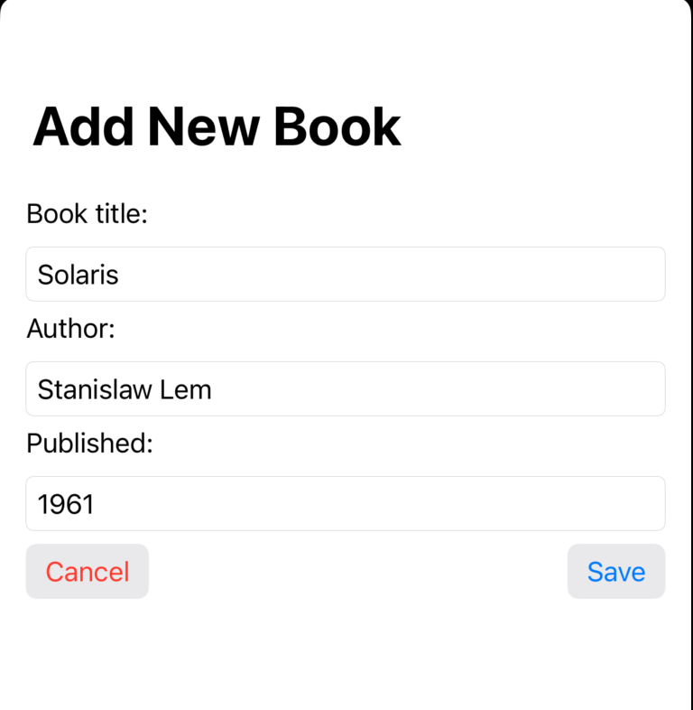
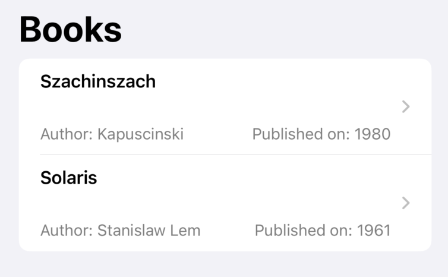
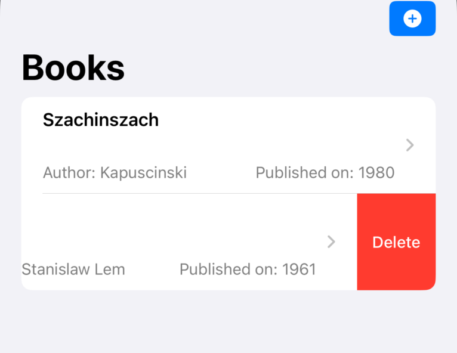
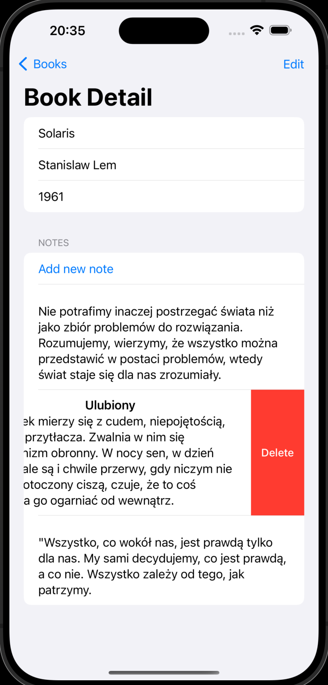

# SwiftData pierwsze kroki


## Wstęp

Apple przedstawiło SwiftData na WWDC 23. Podobnie jak SwiftUI, SwiftData stosuje podejście deklaratywne. SwiftData ułatwia zapisywanie i przechowywanie danych, pozwalając nam modelować i zarządzać danymi za pomocą deklaratywnego kodu, eliminując potrzebę korzystania z plików projektowania schematu modelu (dostępne od wielu lat na IOS CoreData) i wprowadzając kwerendy i filtrowanie danych wyłącznie w kodzie Swift.

SwiftData został zaprojektowany do współpracy zarówno z UIKit, jak i SwiftUI, i doskonale integruje się z SwiftUI. SwiftData jest oparty na Core Data, ale wprowadza nowoczesne podejście do przechowywania danych, dostarczając natywne interfejsy API napisane w języku Swift.

SwiftData wykorzystuje makra do generowania kodu. Makra są kolejną  ciekawą funkcją wprowadzoną na WWDC 23 i służą do generowania szybkiego, wydajnego i bezpiecznego kodu.

SwiftData automatycznie buduje schemat przy użyciu naszych modeli i skutecznie mapuje ich pola do magazynu danych. Obiekty zarządzane przez SwiftData są pobierane z bazy danych w razie potrzeby i automatycznie zapisywane w odpowiednim momencie, bez dodatkowej pracy z naszej strony.

Aby lepiej zrozumieć to zagadnienie, skoncentrujmy się na stworzeniu aplikacji przy użyciu SwiftData. Aplikacja ta będzie służyła do śledzenia przeczytanych przez nas książek i posiadać będzie sekcję notatek dla każdej z nich, umożliwiając nam zapisywanie istotnych aspektów danej lektury.


## Model `Book`

Rozpoczniemy od modelu danych. Nasz model do przechowywania informacji o książkach, będzie nosił nazwę "Book".

```swift
import Foundation

final class Book {
    var title: String
    var author: String
    var publishedYear: Int
    
    init(title: String, author: String, publishedYear: Int) {
        self.title = title
        self.author = author
        self.publishedYear = publishedYear
    }
}
```

*(Przy okazji podpowiedz do Xcode: Wybierz nazwe klasy, prawy klawisz myszy i Refactor-> Generate MemberWise Initializer. )*


Aby przekształcić ten model w model SwiftData, wystarczy zaimportować SwiftData.

```swift
import Foundation
import SwiftData
```

Następnie ozdobimy klasę makrem @Model.

```swift
import Foundation
import SwiftData

@Model
final class Book {
    var title: String
    var author: String
    var publishedYear: Int
    
    init(title: String, author: String, publishedYear: Int) {
        self.title = title
        self.author = author
        self.publishedYear = publishedYear
    }
}
```


To makro Model przekształca klasę Swift w przechowywany model zarządzany przez SwiftData. (**Kodu ponizej nie musisz przepisywać !!!**)

```swift
@Model
final class Book {
    internal init(title: String, author: String, publishedYear: Int) {
        self.title = title
        self.author = author
        self.publishedYear = publishedYear
    }
    
    var title: String
    var author: String
    var publishedYear: Int
  // wszystko poniżej jest wygenerowane dzieki makru @Model
@Transient
private var _$backingData: any SwiftData.BackingData<Book> = Book.createBackingData()

public var persistentBackingData: any SwiftData.BackingData<Book> {
    get {
        _$backingData
    }
    set {
        _$backingData = newValue
    }
}

static var schemaMetadata: [SwiftData.Schema.PropertyMetadata] {
  return [
    SwiftData.Schema.PropertyMetadata(name: "title", keypath: \Book.title, defaultValue: nil, metadata: nil),
    SwiftData.Schema.PropertyMetadata(name: "author", keypath: \Book.author, defaultValue: nil, metadata: nil),
    SwiftData.Schema.PropertyMetadata(name: "publishedYear", keypath: \Book.publishedYear, defaultValue: nil, metadata: nil)
  ]
}

init(backingData: any SwiftData.BackingData<Book>) {
  _title = _SwiftDataNoType()
  _author = _SwiftDataNoType()
  _publishedYear = _SwiftDataNoType()
  self.persistentBackingData = backingData
}

@Transient
private let _$observationRegistrar = Observation.ObservationRegistrar()

struct _SwiftDataNoType {
}
```


 Nie potrzebujemy żadnych dodatkowych plików ani narzędzi do zarządzania modelem danych ani warstwą przechowywania danych. Dodatkowo SwiftData może automatycznie wywnioskować wiele relacji, korzystając z deklaracji, takich jak @Attribute(.unique), aby opisać reguły integralności dla naszych modeli danych.

W przypadku Core Data musimy zainicjować kontener danych, aby uzyskać kontekst modelu, ale w przypadku SwiftData otrzymujemy go za darmo, o ile tworzymy i przekazujemy obiekt ModelContainer. ModelContainer to obiekt zarządzający schematem aplikacji i konfiguracją przechowywania modelu.

W naszym przypadku przekażemy ten kontener z poziomu struktury App.

```swift
import SwiftUI
import SwiftData

@main
struct SwiftDataFirstBloodApp: App {
    var body: some Scene {
        WindowGroup {
            ContentView()
                .modelContainer(for: Book.self)
        }
    }
}
```


### Dopisywanie nowej ksiązki `AddNewBookView`

Dodajmy widok do dodawania nowej książki do naszej aplikacji. Wybieramy Cmd+N, następnie SwiftUI View i w nazwie wpisujemy: `AddNewBookView`

Zaczniemy od importu SwiftData.

```swift
import SwiftUI
import SwiftData

struct AddNewBookView: View {
    var body: some View {
        Text("Hello, World!")
    }
}

#Preview {
    AddNewBookView()
}
```

Oto reszta interfejsu użytkownika (UI), która pozwala na dodawanie nowej książki do naszej listy czytanych książek. Ten kod zawiera pola do wprowadzenia tytułu, autora i roku publikacji, a także przyciski "Anuluj" i "Zapisz" do zarządzania operacjami.

```swift
import SwiftUI
import SwiftData

struct AddNewBookView: View {
    @Environment(\.modelContext) private var context
    @Environment(\.dismiss) private var dismiss

    @State private var title: String = ""
    @State private var author: String = ""
    @State private var publishedYear: Int?
    var body: some View {

        NavigationStack {
            VStack( alignment: .leading){
                Text("Book title:")
                TextField("Enter title",text: $title)
                    .textFieldStyle(.roundedBorder)

                Text("Author:")
                TextField("Enter book author",text: $author)
                    .textFieldStyle(
                        .roundedBorder)

                Text("Published:")
                TextField(
                    "Enter published year",
                    value: $publishedYear,
                    format: .number
                )
                .textFieldStyle(.roundedBorder)
                .keyboardType(.numberPad)

                HStack {

                    Button("Cancel", role: .destructive) {
                        dismiss()
                    }
                    .buttonStyle(.bordered)

                    Spacer()

                    Button("Save") {
                        guard let publishedYear = publishedYear else { return }
                        let book = Book(title: title, author: author, publishedYear: publishedYear)

                        context.insert(book)

                        do {
                            try context.save()
                        } catch {
                            print(error.localizedDescription)
                        }

                        dismiss()
                    }
                    .buttonStyle( .bordered )
                    .disabled(!isFormValid)
                }
                Spacer()
            }
            .padding()
            .navigationTitle("Add New Book")
        }
    }

    private var isFormValid: Bool {
        !title.isEmpty && !author.isEmpty && publishedYear != nil
    }
}

#Preview {
    AddNewBookView()
        .modelContainer(for: [Book.self])
}

```

Ten kod definiuje widok (`View`), który pozwala użytkownikowi wprowadzić informacje o nowej książce, takie jak tytuł, autor i rok publikacji. Wprowadzone dane są przechowywane w zmiennych stanu (`@State`), a przyciski "Anuluj" i "Zapisz" pozwalają na zarządzanie operacjami anulowania i zapisywania nowej książki. Widok ten jest dodatkowo umieszczony w nawigacyjnym stosie (`NavigationStack`) i ma tytuł "Dodaj Nową Książkę".


Mamy już przygotowany interfejs użytkownika (UI), więc teraz dodajmy część związana z SwiftData, która pomoże nam zapisać wprowadzone informacje. Ponieważ przekazujemy kontener modeli za pomocą App, możemy uzyskać dostęp do obiektu środowiskowego (`@Environment`) w celu uzyskania dostępu do kontekstu modelu.

```swift
import SwiftUI
import SwiftData

struct AddNewBookView: View {
    @Environment(\.modelContext) private var context
    
    @State private var title: String = ""
    @State private var author: String = ""
    @State private var publishedYear: Int?
   ...
```

Dodajmy to do naszego widoku `AddNewBookView` (upewnij się, że zaimportowano SwiftData). Musimy również dodać sposób na zamknięcie tego widoku, ponieważ zostanie on prezentowany jako arkusz. Skorzystajmy z funkcji dismiss z obiektu środowiskowego (`@Environment`), aby zamknąć ten widok.

```swift
@Environment(\.dismiss) private var dismiss
```

Dodajmy to również do pliku (upewnij się, że jest zaimportowany SwiftUI i SwiftData). Chcemy upewnić się, że wszystkie informacje związane z książką zostały wprowadzone przez użytkownika, zanim włączymy przycisk "Zapisz". Dlatego napiszemy prostą właściwość obliczeniową do sprawdzania poprawności formularza wprowadzania.

```swift
import SwiftUI
import SwiftData

struct AddNewBookView: View {
    @Environment(\.modelContext) private var context
    @Environment(\.dismiss) private var dismiss
    
    @State private var title: String = ""
    @State private var author: String = ""
    @State private var publishedYear: Int?
    
    private var isFormValid: Bool {
        // Tutaj możesz dodać kod sprawdzający poprawność wprowadzonych danych
        // Zwróć true, jeśli dane są poprawne, w przeciwnym razie false
        return true // Zmień to na właściwą logikę
    }
    
    // ...
}
```

To jest początkowy kod, który pozwala na dostęp do kontekstu modelu (`context`) i funkcji zamknięcia widoku (`dismiss`). Właściwość `isFormValid` jest obecnie zawsze ustawiona na `true`. Musisz dostosować tę właściwość, aby uwzględniała warunki poprawności formularza wprowadzania danych, na przykład sprawdzając, czy wszystkie pola są wypełnione.

Chcemy upewnić się, że użytkownik wprowadzi wszystkie informacje dotyczące książki, zanim włączymy przycisk "Zapisz", dlatego napiszemy prostą funkcję, aby sprawdzić poprawność danych tego formularza.

```swift
private var isValid: Bool {
    !title.isEmpty && !author.isEmpty && publishedYear != nil
}
```

Dodajmy funkcjonalność zapisywania do przycisku "Save".

```swift
Button("Save") {
    guard let publishedYear = publishedYear else { return }
    let book = Book(title: title, author: author, publishedYear: publishedYear)
    
    context.insert(book)
    
    do {
        try context.save()
    } catch {
        print(error.localizedDescription)
    }
    
    dismiss()
}
.buttonStyle(
    .bordered
)
.disabled(!isValid)
```

Ten kod sprawdza, czy wszystkie wymagane pola są wypełnione, a także tworzy i zapisuje nową książkę w bazie danych, gdy użytkownik naciśnie przycisk "Save".

Dodatkowo obsłużymy operacje anulowania. Dodajemy wywołanie funkcji dismiss w bloku akcji przycisku "Cancel", aby zamknąć ten widok.

```swift
Button("Cancel",role: .destructive) {
    dismiss()
}
.buttonStyle(
    .bordered
)
```




Udało nam się zapisać książkę, ale w tym momencie nie mamy sposobu, aby zobaczyć wszystkie zapisane książki, i to jest kolejne wyzwanie: 

### Lista książek `BookListView`

Zacznijmy od stworzenia widoku do wyświetlania listy książek. Cmd+N, wybieramy SwiftUI View i nazywamy go `BookListView`

```swift
import SwiftUI
import SwiftData

struct BookListView: View {
    @Query private var books: [Book]

    var body: some View {
        NavigationStack {
            List {
                ForEach(books) { book in
                    Text(book.title)
                }
            }
            .navigationBarTitle("Books")
        }
    }
}
```

Następnie zaktualizuj plik zawartości  `ContentView.swift`, aby zawierał nowo utworzony widok `BookListView`.

```swift
import SwiftUI

struct ContentView: View {
    var body: some View {
        BookListView()
    }
}

#Preview {
    ContentView()
}
```

W powyższym kodzie mamy widok `BookListView`, który używa `@Query`, aby pobrać listę książek z bazy danych i wyświetlić je w formie listy. Następnie w widoku `ContentView`, który jest głównym widokiem naszej aplikacji, dodajemy `BookListView` jako jego treść. Teraz `BookListView` będzie wyświetlane jako część aplikacji.

```swift
import SwiftUI

struct ContentView: View {
    @State private var presentAddNew = false
    var body: some View {
        VStack {
            BookListView()
            
            Button("Add new book") {
                presentAddNew.toggle()
            }
            .sheet(isPresented: $presentAddNew, content: {
                AddNewBookView()
            })
        }
    }
}

#Preview {
    ContentView()
}
```


Nasza lista książek wyświetla tylko nazwę książki, ale nie wyświetla innych informacji, więc ulepszmy komórkę listy, aby wyświetlać więcej informacji.

```swift
import SwiftUI
import SwiftData

struct BookListView: View {
    @Query private var books: [Book]

    var body: some View {
        NavigationView {
            List {
                ForEach(books) { book in
                    VStack(alignment: .leading) {
                        Text(book.title)
                            .bold()
                        HStack {
                            Text("Autor: \(book.author)")
                            Spacer()
                            Text("Opublikowano: \(book.publishedYear.description)")
                        }
                        .font(.subheadline)
                        .foregroundStyle(.secondary)
                        .padding(.top, 20)
                    }
                }
            }
            .navigationBarTitle("Books")
        }
    }
}

#Preview {
    BookListView()
}
```

Jednak w celu zwiekszenia przejrzystosci kodu, fragment odpowiedzialny za pojedynczy wiersz przeniesiemy do osobnego widoku `BookCellView`

```swift
import SwiftUI

struct BookCellView: View {
    let book: Book
    
    var body: some View {
        VStack(alignment: .leading) {
            Text(book.title)
                .bold()
            HStack {
                Text("Autor: \(book.author)")
                Spacer()
                Text("Opublikowano: \(book.publishedYear.description)")
            }
            .font(.subheadline)
            .foregroundStyle(.secondary)
            .padding(.top, 20)
        }
    }
}
```

Zaktualizujmy teraz widok `BookListView`, aby uwzględniał ten nowo utworzony widok.

```swift
struct BookListView: View {
    @Query private var books: [Book]
    
    var body: some View {
        NavigationStack {
            List {
                ForEach(books) { book in
                    BookCellView(book: book)
                }
            }
            .navigationTitle("Book Diary")
        }
    }
}
```

Teraz lista książek będzie wyświetlać więcej informacji o każdej książce dzięki widokowi `BookCellView`.



Teraz mamy aplikację, która może trwale przechowywać dane za pomocą **SwiftData**, a także możemy przeglądać wszystkie zapisane rekordy między uruchomieniami aplikacji, więc teraz dodamy funkcjonalność usuwania rekordów, abyśmy mogli usunąć rekord ze magazynu danych.

Zacznijmy od przekazania do widoku kontekstu modelu za pomocą obiektu **Environment**, dzięki czemu będziemy mogli pracować nad kontekstem, aby usunąć rekord i zapisać zmiany z powrotem w bazie danych.

```swift
import SwiftUI
import SwiftData

struct BookListView: View {
    @Environment(\.modelContext) private var context
    
    @Query private var books: [Book]
```

Najpierw dodamy prywatną funkcję do widoku, która będzie wykonywać operację usuwania.

```swift
private func delete(indexSet: IndexSet) {
    indexSet.forEach { index in
        let book = books[index]
        context.delete(book)
        
        do {
            try context.save()
        } catch {
            print(error.localizedDescription)
        }
    }
}
```

Teraz przekażmy tę funkcję jako parametr do modyfikatora **onDelete** dla widoku **ForEach**.

```swift
import SwiftUI
import SwiftData

struct BookListView: View {
    @Environment(\.modelContext) private var context
    
    @Query private var books: [Book]
    
    var body: some View {
        NavigationStack {
            List {
                ForEach(books) { book in
                    BookCellView(book: book)
                }
                .onDelete(perform: delete(indexSet:))
            }
            .navigationTitle("Reading Logs")
        }
    }
    
    private func delete(indexSet: IndexSet) {
        indexSet.forEach { index in
            let book = books[index]
            context.delete(book)
            do {
                try context.save()
            } catch {
                print(error.localizedDescription)
            }
        }
    }
}

#Preview {
    BookListView()
        .modelContainer(for: [Book.self])
}

```

Zbuduj i uruchom aplikację na symulatorze, aby dodać nowy rekord do naszego dziennika czytania. Teraz możemy przeciągnąć, aby usunąć rekord z listy. 



Przydałoby się móc modyfikować już wpisane dane:

### Aktualizacja danych `BookDetailView`

Dodajmy funkcjonalność aktualizacji do naszej aplikacji do rejestrowania przeczytanych książek. Rozpoczniemy od stworzenia nowego widoku SwiftUI o nazwie `BookDetailView`, który pozwoli nam zobaczyć szczegóły wybranej książki oraz umożliwi aktualizację tych szczegółów, jeśli będzie to konieczne.

Dodajmy właściwość książki, która zostanie przekazana przy inicjalizacji widoku szczegółowego:

```swift
import SwiftUI

struct BookDetailView: View {
    let book: Book
    
    var body: some View {
        Text("Hello, World!")
    }
}
```

Potrzebujemy także dostępu do kontekstu modelu, aby zapisać zmiany w magazynie danych wraz z możliwością odrzucenia prezentowanego widoku. Obydwa możemy uzyskać za pomocą obiektów środowiska.

```swift
import SwiftUI

struct BookDetailView: View {
    let book: Book
    
    @Environment(\.modelContext) private var context
    @Environment(\.dismiss) private var dismiss
    
    var body: some View {
        Text("Hello, World!")
    }
}
```

Tworzymy kilka właściwości stanu (`@State`), w tym `isEditing`, który będzie wskazywał, czy widok jest w trybie edycji, oraz właściwości `title`, `author` i `publishedYear`, które będą przechowywać informacje o książce. Te wartości zostaną zainicjowane na podstawie przekazanego obiektu książki.

```swift
struct BookDetailView: View {
    let book: Book
    
    @Environment(\.modelContext) private var context
    @Environment(\.dismiss) private var dismiss
    
    @State private var isEditing = false
    
    @State private var title: String = ""
    @State private var author: String = ""
    @State private var publishedYear: Int? = nil
    
    init(book: Book) {
        self.book = book
        self._title = State.init(initialValue: book.title)
        self._author = State.init(initialValue: book.author)
        self._publishedYear = State.init(initialValue: book.publishedYear)
    }
```

Następnie w ciele widoku `BookDetailView` dodajemy formularz (`Form`). Jeśli `isEditing` jest ustawione na `true`, wyświetlamy grupę pól tekstowych (`TextField`), w przeciwnym razie wyświetlamy informacje o książce w polach tekstowych (`Text`). Dodajemy także pasek narzędziowy (`toolbar`), który zawiera przycisk do przełączania stanu edycji widoku.

To pozwoli nam na wyświetlanie i aktualizację informacji o książce w naszej aplikacji.

```swift
struct BookDetailView: View {
    let book: Book
    
    @Environment(\.modelContext) private var context
    @Environment(\.dismiss) private var dismiss
    
    @State private var isEditing = false
    
    @State private var title: String = ""
    @State private var author: String = ""
    @State private var publishedYear: Int? = nil
    
    init(book: Book) {
        self.book = book
        self._title = State.init(initialValue: book.title)
        self._author = State.init(initialValue: book.author)
        self._publishedYear = State.init(initialValue: book.publishedYear)
    }
    
    var body: some View {
        Form {
            if isEditing {
                Group {
                    TextField("Book title", text: $title)
                    TextField("Book author", text: $author)
                    TextField("Published year", value: $publishedYear, formatter: NumberFormatter())
                        .keyboardType(.numberPad)
                }
                .textFieldStyle(.roundedBorder)
            } else {
                Text(book.title)
                Text(book.author)
                Text(book.publishedYear.description)
            }
        }
        .toolbar {
            ToolbarItem(placement: .topBarTrailing) {
                Button(isEditing ? "Done" : "Edit") {
                    isEditing.toggle()
                }
            }
        }
        .navigationTitle("Book Detail")
    }
}
```

Dodajmy teraz funkcjonalność pozwalająca zapisywać dane do bazy:

```swift
                Button("Save") {
                    guard let publishedYear = publishedYear else { return }
                    book.title = title
                    book.author = author
                    book.publishedYear = publishedYear
                    
                    do {
                        try context.save()
                    } catch {
                        print(error.localizedDescription)
                    }
                    
                    dismiss()
                }
```

Całość `BookDetailView` powinna wyglądać tak:

```swift
struct BookDetailView: View {
    let book: Book
    
    @Environment(\.modelContext) private var context
    @Environment(\.dismiss) private var dismiss
    
    @State private var isEditing = false
    
    @State private var title: String = ""
    @State private var author: String = ""
    @State private var publishedYear: Int? = nil
    
    init(book: Book) {
        self.book = book
        self._title = State.init(initialValue: book.title)
        self._author = State.init(initialValue: book.author)
        self._publishedYear = State.init(initialValue: book.publishedYear)
    }
    
    var body: some View {
        Form {
            if isEditing {
                Group {
                    TextField("Book title", text: $title)
                    TextField("Book author", text: $author)
                    TextField("Published year", value: $publishedYear, formatter: NumberFormatter())
                        .keyboardType(.numberPad)
                }
                .textFieldStyle(.roundedBorder)
                Button("Save") {
                    guard let publishedYear = publishedYear else { return }
                    book.title = title
                    book.author = author
                    book.publishedYear = publishedYear
                    
                    do {
                        try context.save()
                    } catch {
                        print(error.localizedDescription)
                    }
                    
                    dismiss()
                }
            } else {
                Text(book.title)
                Text(book.author)
                Text(book.publishedYear.description)
            }
        }
        .toolbar {
            ToolbarItem(placement: .topBarTrailing) {
                Button(isEditing ? "Done" : "Edit") {
                    isEditing.toggle()
                }
            }
        }
        .navigationTitle("Book Detail")
    }
}
```


Będziemy uruchamiać widok szczegółów z widoku `BookCellView`, więc zaktualizujmy ten widok, aby zawierał widok `NavigationLink` i modyfikator `navigationDestination`. Oto, jak możemy to zrobić:

```swift
import SwiftUI

struct BookCellView: View {
    let book: Book
    
    var body: some View {
        NavigationLink(value: book) {
            VStack(alignment: .leading) {
                Text(book.title)
                    .bold()
                HStack {
                    Text("Author: \(book.author)")
                    Spacer()
                    Text("Published on: \(book.publishedYear.description)")
                }
                .font(.subheadline)
                .foregroundStyle(.secondary)
                .padding(.top, 20)
            }
        }
        .navigationDestination(for: Book.self) { book in
            BookDetailView(book: book)
        }
    }
}
```

Teraz w widoku `BookCellView` mamy `NavigationLink`, który przenosi do widoku szczegółów (`BookDetailView`) po naciśnięciu komórki z informacjami o książce. Zastosowaliśmy także modyfikator `navigationDestination`, aby określić, do którego widoku ma prowadzić link i przekazać odpowiednią książkę jako wartość. Teraz, po zbudowaniu i uruchomieniu aplikacji, powinno działać przejście do widoku szczegółów po kliknięciu w komórkę z książką.


Nasz przycisk "Dodaj nową książkę" pojawia się także w widoku szczegółowym książki. Aby to naprawić, przenieśmy go do paska narzędziowego (`toolbar`) widoku nawigacyjnego na stronie listy książek. Oto, jak możemy to zrobić:

```swift
struct BookListView: View {
    @Environment(\.modelContext) private var context
    @Query private var books: [Book]
    @State private var presentAddNew = false
    
    var body: some View {
        NavigationStack {
            List {
                ForEach(books) { book in
                    BookCellView(book: book)
                }
                .onDelete(perform: delete(indexSet:))
            }
            .navigationTitle("Reading Logs")
            .toolbar {
                ToolbarItem(placement: .topBarTrailing) {
                    Button{
                        presentAddNew.toggle()
                    } label: {
                        Image(systemName: "plus.circle.fill")
                    }
                    .buttonStyle(.borderedProminent)
                    .sheet(isPresented: $presentAddNew, content: {
                        AddNewBookView()
                    })
                }
            }
        }
    }
    
    private func delete(indexSet: IndexSet) {
        indexSet.forEach { index in
            let book = books[index]
            context.delete(book)
            
            do {
                try context.save()
            } catch {
                print(error.localizedDescription)
            }
        }
    }
}

#Preview {
    BookListView()
        .modelContainer(for: [Book.self])
}
```


##  Model `Notes`. Relacje z innymi danymi

​	Nasz dziennik czytelniczy zawiera spis książek, które dotąd przeczytaliśmy, ale co jeśli chcemy zapamiętać rzeczy, które nam się podobają w książce, na przykład ważne cytaty itp.? Możemy rozwiązać ten problem, dodając możliwość robienia notatek na poziomie książki, dzięki czemu każdy rekord książki będzie miał miejsce na dodawanie notatek o niej.
W tym przypadku łączymy ze sobą dwa rekordy (Książka i Notatka) za pomocą wspólnego ogniwa. To połączenie nazywa się relacją między rekordami. Istnieją różne rodzaje relacji między rekordami.

**Relacja jeden do jeden (1:1):** W relacji jeden do jeden, każdy rekord po jednej stronie relacji jest powiązany dokładnie z jednym rekordem po drugiej stronie, i vice versa. Na przykład możemy mieć rekord "`Osoba`" z relacją jeden do jeden z rekordem "`Paszport`", gdzie każda osoba ma tylko jeden paszport.

**Relacja jeden do wielu (1:N):** W relacji jeden do wielu, każdy rekord po jednej stronie relacji może być powiązany z wieloma rekordami po drugiej stronie, ale każdy rekord po drugiej stronie jest powiązany tylko z jednym rekordem po pierwszej stronie. Na przykład możemy mieć rekord "Dział" z relacją jeden do wielu z rekordem "`Pracownik`", gdzie każdy dział może mieć wielu pracowników, ale każdy pracownik należy tylko do jednego działu.

**Relacja wiele do jeden (N:1):** To jest odwrotność relacji jeden do wielu. Każdy rekord po jednej stronie jest powiązany z jednym rekordem po drugiej stronie, ale każdy rekord po drugiej stronie może być powiązany z wieloma rekordami po pierwszej stronie. Korzystając z tego samego przykładu "`Dział`" i "`Pracownik`", oznaczałoby to, że każdy pracownik należy do jednego działu, ale wiele pracowników może należeć do tego samego działu.

**Relacja wiele do wielu (N:N):** W relacji wiele do wielu, wiele rekordów po jednej stronie może być powiązanych z wieloma rekordami po drugiej stronie. Na przykład możemy mieć rekord "`Student`", rekord "`Kurs`" i rekord "`Rejestracja`", aby reprezentować relację wiele do wielu między studentami a kursami, gdzie każda rejestracja łączy studenta z kursem.

​	W naszym przypadku relacja jest jednostronna, gdzie jedna książka będzie zawierać wiele notatek.
Zacznijmy od stworzenia nowego modelu dla notatki do książki. Będziemy nazywać tę klasę "`Notatka`".

```swift
import Foundation
import SwiftData

@Model
final class Note {
    var title: String
    var message: String
    var book: Book?
    
    init(title: String, message: String, book: Book? = nil) {
        self.title = title
        self.message = message
        self.book = book
    }
}
```


Aby powiązac ten rekord z książka musimy w modelu Book dodać informację o relacji:

```swift
import Foundation
import SwiftData

@Model
final class Book {
    var title: String
    var author: String
    var publishedYear: Int
    
    @Relationship(deleteRule: .cascade, inverse: \Note.book)
    var notes = [Note]()
    
    init(title: String, author: String, publishedYear: Int) {
        self.title = title
        self.author = author
        self.publishedYear = publishedYear
    }
}
```


Zauważ, że ustawiamy `deleteRule` dla tej relacji jako `cascade`, co oznacza, że po usunięciu tej książki wszelkie powiązane modele również zostaną usunięte. Inne reguły usuwania obejmują:

- `noAction`: Reguła, która nie wprowadza zmian w powiązanych modelach.
- `nullify`: Reguła, która ustawia na `null` referencję do powiązanego modelu.
- `deny`: Reguła, która uniemożliwia usunięcie modelu, ponieważ zawiera jedno lub więcej odniesień do innych modeli.
- `cascade`: Reguła, która usuwa wszelkie powiązane modele.

Opcja `inverse` tworzy połączenie między modelem książki a właściwością `book` notatki.


### Widok do dopisywania notatek `AddNewNote`

Po przygotowaniu modeli i ustanowieniu relacji między nimi, możemy zacząć rozwijać nasze widoki. Zaczynamy od utworzenia `AddNewNote` do ktorego przekażemy obiekt Book jako parametr wejściowy i zadeklarujemy 2 zmienne do ktorych beda wpisywane dane:

```swift
import SwiftUI
import SwiftData

struct AddNewNote: View {
      let book: Book
    
    @State private var title: String = ""
    @State private var message: String = ""
  
    var body: some View {
        Text("Hello !")
    }
}
```


dodajemy informacje o kontekscie i zmienną do sterowania formularzem

```swift
struct AddNewNote: View {
    let book: Book
    ...
    @Environment(\.modelContext) private var context
    @Environment(\.dismiss) private var dismiss
      var body: some View {...
         }
```


dodajemy formularz z polami do wprowadzania danych:

```swift
        Form {
            TextField("Note title", text: $title)
            TextField("Note", text: $message)
        }
        .navigationTitle("Add new note")
```


przyciski Save i Close

```swift
        .toolbar {
            ToolbarItem(placement: .topBarLeading) {
                Button("Close") {
                    dismiss()
                }
            }
            
            ToolbarItem(placement: .topBarTrailing) {
                Button("Save") {
                    let note = Note(title: title, message: message)
                    note.book = book
                    context.insert(note)
                    
                    do {
                        try context.save()
                        book.notes.append(note)
                    } catch {
                        print(error.localizedDescription)
                    }
                    
                    dismiss()
                }
            }
        }
```


```swift
struct AddNewNote: View {
    let book: Book
    
    @State private var title: String = ""
    @State private var message: String = ""
    
    @Environment(\.modelContext) private var context
    @Environment(\.dismiss) private var dismiss
    
    var body: some View {
        Form {
            TextField("Note title", text: $title)
            TextField("Note", text: $message)
        }
        .navigationTitle("Add new note")
        .toolbar {
            ToolbarItem(placement: .topBarLeading) {
                Button("Close") {
                    dismiss()
                }
            }
            
            ToolbarItem(placement: .topBarTrailing) {
                Button("Save") {
                    let note = Note(title: title, message: message)
                    note.book = book
                    context.insert(note)
                    
                    do {
                        try context.save()
                        book.notes.append(note)
                    } catch {
                        print(error.localizedDescription)
                    }
                    
                    dismiss()
                }
            }
        }
    }
}
```

### Lista notatek w książce `NotesListView`

Dodajemy widok do wyświetlania listy naszych notatek `NotesListView`:

Obiekt książki zostanie przekazany jako parametr wejściowy tego widoku, a my użyjemy widoku List i ForEach do wyrenderowania listy notatek na temat książki.

```swift
import SwiftUI
import SwiftData

struct NotesListView: View {
    let book: Book

    var body: some View {
        List {
            ForEach(book.notes) { note in

                VStack {
                    Text(note.title)
                        .bold()
                    Text(note.message)

                }
            }
        }
    }
}
```

Dodajmy ten widok jako sekcję do widoku szczegółowego książki.

Zacznij od dodania nowego właściwości stanu (`@State` property) w celu przełączania arkusza do dodawania nowej notatki w widoku `BookDetailView`:

```swift
@State private var showAddNewNote = false
```

Następnie stwórz nową sekcję pod formularzem dla notatek:

```swift
struct BookDetailView: View { 
  @State private var showAddNewNote = false
  ...
var body: some View {
    Form {
        if isEditing {
            // ...
        } else {
            // ...
        }
        
        Section("Notes") {
            Button("Add new note") {
                showAddNewNote.toggle()
            }
            .sheet(isPresented: $showAddNewNote, content: {
                NavigationStack {
                    AddNewNote(book: book)
                }
            })
        }
    }
}
```

Ponieważ widok dodawania nowej notatki ma tylko dwie pola, byłoby rozsądne, aby zajmował tylko część ekranu, a nie uruchamiał się jako pełny arkusz. Możemy to osiągnąć, korzystając z "presentation detents". Wyłączmy również funkcję przeciągnięcia do zamknięcia arkusza, dzięki czemu użytkownik może zamknąć widok dodawania notatki tylko poprzez naciśnięcie jednego z przycisków w nim dostępnych.

```swift
Section("Notes") {
                Button("Add new note") {
                    showAddNewNote.toggle()
                }
                .sheet(isPresented: $showAddNewNote, content: {
                    NavigationStack {
                        AddNewNote(book: book)
                    }
                    .presentationDetents([.fraction(0.3)])
                    .interactiveDismissDisabled()
                })
                
            }
```


Jesteśmy gotowi, aby wyświetlić wszystkie notatki powiązane z bieżącą książką. Podczas wyświetlania notatek miałoby sens pokazać pusty stan, aby poinformować użytkownika, że nie ma notatek, jeśli jeszcze nie dodał żadnych notatek do książki. W tym celu użyjemy widoku `ContentUnavailable`.

```swift
Section("Notes") {
    Button("Add new note") {
        showAddNewNote.toggle()
    }
    .sheet(isPresented: $showAddNewNote, content: {
        NavigationStack {
            AddNewNote(book: book)
        }
        .presentationDetents([.fraction(0.3)])
        .interactiveDismissDisabled()
    })

    if book.notes.isEmpty {
        ContentUnavailableView("No notes", systemImage: "note")
    } else {
        NotesListView(book: book)
    }
}
```

Zbuduj i uruchom aplikację, aby zobaczyć to w działaniu.


Teraz mamy możliwość dodawania notatek do książek, ale co jeśli wprowadzimy notatkę przez pomyłkę? Nie byłoby miło móc ją usunąć? Dla tego celu dodajmy funkcję usuwania notatki do listy notatek.

Przejdź z powrotem do widoku `NotesListView` i dodaj zmienną środowiskową (`@Environment(\.modelContext) private var context`) dla dostępu do kontekstu modelu. Następnie dodajmy prywatną funkcję do obsługi operacji usuwania.

```swift
struct NotesListView: View {
    let book: Book
    @Environment(\.modelContext) private var context
    
private func deleteNote(indexSet: IndexSet) {
        indexSet.forEach { index in
            let note = book.notes[index]
            context.delete(note)
            book.notes.remove(at: index)
            do {
                try context.save()
            } catch {
                print(error.localizedDescription)
            }
        }
    }
    
    var body: some View {
        // ... reszta widoku
    }
}
```

Teraz możemy wywołać tę funkcję w widoku, gdzie użytkownik ma możliwość usuwania notatek, używając `.onDelete(perform: deleteNote)`. Na przykład:

```swift
List {
    ForEach(book.notes, id: \.self) { note in
        // Wyświetl notatkę
    }
    .onDelete(perform: deleteNote)
}
```

W ten sposób użytkownik będzie mógł usuwać notatki z listy, przeciągając w lewo na notatce lub używając przycisku "Edytuj" i naciskając czerwony przycisk "Usuń". Pamiętaj, że operacje usuwania powinny być ostrożnie obsługiwane, aby uniknąć przypadkowego usunięcia ważnych danych.

cały widok:

```swift
import SwiftUI
import SwiftData

struct NotesListView: View {
    let book: Book
    @Environment(\.modelContext) private var context

    var body: some View {
        List {
            ForEach(book.notes) { note in

                VStack {
                    Text(note.title)
                        .bold()
                    Text(note.message)

                }
            }
            .onDelete(perform: deleteNote(indexSet:))
        }
    }

    private func deleteNote(indexSet: IndexSet) {
            indexSet.forEach { index in
                let note = book.notes[index]
                context.delete(note)
                book.notes.remove(at: index)
                do {
                    try context.save()
                } catch {
                    print(error.localizedDescription)
                }
            }
        }
}
```



## Model Genre - rozbudowa o gatunek literacki

Książki są podzielone na gatunki literackie, dlatego logiczne byłoby, gdyby nasz dziennik książek zawierał klasyfikację gatunkową, która pomogłaby nam śledzić liczbę przeczytanych przez nas książek fikcyjnych i niefikcyjnych.
Biorąc pod uwagę, że gatunek może obejmować wiele książek i odwrotnie, książkę można powiązać z wieloma gatunkami literackimi, ten scenariusz oferuje doskonałą okazję do przetestowania, w jaki sposób SwiftData zarządza relacją wiele do wielu (N:N).
Zaczniemy od dodania nowego modelu do naszego projektu.

```swift
import Foundation
import SwiftData

@Model
final class Genre {
    var name: String
    var books = [Book]()
    
    init(name: String) {
        self.name = name
    }
}
```

Zaktualizujmy także model książki, aby uwzględnić relację między modelami gatunku i książki.
Relacja między książką a gatunkiem będzie opierać się na zasadzie zerowania usuwanych relacji `nullify delete rule`, zasadniczo unieważniając odniesienie powiązanego modelu do usuniętego modelu. Definiując tę regułę usuwania, gwarantujemy, że w przypadku usunięcia książki nie zostanie usunięta kategoria gatunku.


```swift
import Foundation
import SwiftData

@Model
final class Book {
    ...
    
    @Relationship(deleteRule: .nullify, inverse: \Genre.books)
    var genres = [Genre]()
    
    init(title: String, author: String, publishedYear: Int) {
     ...
    }
}
```


### Lista gatunków literackich `GenreListView`

Dodajmy widok pokazujący wszystkie gatunki. Będziemy używać makra `Query` do pobrania rekordów przechowywanych w tabeli `Genre`.

```swift
import SwiftUI
import SwiftData

struct GenreListView: View {
    
    @Query(sort: \Genre.name) private var genres: [Genre]
    
    var body: some View {
        NavigationStack {
            List {
                ForEach(genres) { genre in
                    Text(genre.name)
                }
            }
            .navigationTitle("Literary Genres")
        }
    }
}

#Preview {
    GenreListView()
}
```

Następnie dodamy ten widok do ContentView. Nasza aplikacja wyświetli książki i gatunki w widoku TabView.

```swift
import SwiftUI

struct ContentView: View {
    var body: some View {
        TabView {
            BookListView()
                .tabItem {
                    Image(systemName: "books.vertical.fill")
                    Text("Books")
                }
            GenreListView()
                .tabItem {
                    Image(systemName: "gear.circle")
                    Text("Genre")
                }
        }
    }
}

#Preview {
    ContentView()
}
```


### Dodawanie gatunków literackich `AddNewGenre`

Następnie dodamy widok umożliwiający utworzenie nowej kategorii gatunku. Ten widok będzie prezentowany jako dolny arkusz i będzie miał pojedynczy widok TextField, w którym można dodać nowy gatunek.

```swift
import SwiftUI
import SwiftData

struct AddNewGenre: View {
    @State private var name: String = ""
    
    @Environment(\.modelContext) private var context
    @Environment(\.dismiss) private var dismiss
    
    var body: some View {
        NavigationStack {
            VStack {
                TextField("Add New Genre", text: $name)
                    .textFieldStyle(.roundedBorder)
                    .navigationTitle("Add New Genre")
                    .padding(.horizontal)
                
                HStack {
                    Button("Save") {
                        let genre = Genre(name: name)
                        context.insert(genre)
                        do {
                            try context.save()
                        } catch {
                            print(error.localizedDescription)
                        }
                        dismiss()
                    }
                    .buttonStyle(.borderedProminent)
                    
                    Button("Cancel") {
                        dismiss()
                    }
                    .buttonStyle(.bordered)
                }
                
                Spacer()
            }
        }
    }
}

#Preview {
    AddNewGenre()
}
```

Dodajmy punkt uruchamiania widoku `AddNewGenre`. Uruchomimy ten widok z `GenreListView`, więc dodajmy zaraz po navigationTitle nowy `ToolBarItem`.

```swift
            .toolbar {
                ToolbarItem(placement: .topBarTrailing) {
                    Button{
                        presentAddNew.toggle()
                    } label: {
                        Image(systemName: "plus.circle.fill")
                    }
                    .buttonStyle(.borderedProminent)
                    .sheet(isPresented: $presentAddNew, content: {
                        AddNewGenre()
                            .presentationDetents([.fraction(0.3)])
                            .interactiveDismissDisabled()
                    })
                }
            }
```

 Deklarujemy też zmienną `presentAddNew` sterująca pokazywaniem arkusza do wprowadzania gatunku.

```swift
import SwiftUI
import SwiftData

struct GenreListView: View {
    
    ...
    
    @State private var presentAddNew = false
    
    var body: some View {
        NavigationStack {
            ...
            .navigationTitle("Literary Genres")
            .toolbar {
                ToolbarItem(placement: .topBarTrailing) {
                    Button{
                        presentAddNew.toggle()
                    } label: {
                        Image(systemName: "plus.circle.fill")
                    }
                    .buttonStyle(.borderedProminent)
                    .sheet(isPresented: $presentAddNew, content: {
                        AddNewGenre()
                            .presentationDetents([.fraction(0.3)])
                            .interactiveDismissDisabled()
                    })
                }
            }
        }
    }
}

#Preview {
    GenreListView()
}
```

Dodajmy od razu funkcjonalnośc usuwania rekordów z listy:

1. Będziemy potrzebować dostępu do kontekstu modelu w GenreListView, aby wykonać operację usuwania. 

   - ```swift
     @Environment(\.modelContext) private var context
     ```

     

2. Następnie dodamy prywatną funkcję usuwania gatunku z listy

   - ```swift
     private func deleteGenre(indexSet: IndexSet) {
             indexSet.forEach { index in
                 let genreToDelete = genres[index]
                 context.delete(genreToDelete)
                 do {
                     try context.save()
                 } catch {
                     print(error.localizedDescription)
                 }
             }
         }
     ```

     

3. Wywołajmy tę funkcję za pomocą modyfikatora onDelete w widoku ForEach.

   - ```swift
         var body: some View {
             NavigationStack {
                 List {
                     ForEach(genres) { genre in
                         Text(genre.name)
                     }
                     .onDelete(perform: deleteGenre(indexSet:))
                 }
                 ...
             }
         }
     ```

     

   
