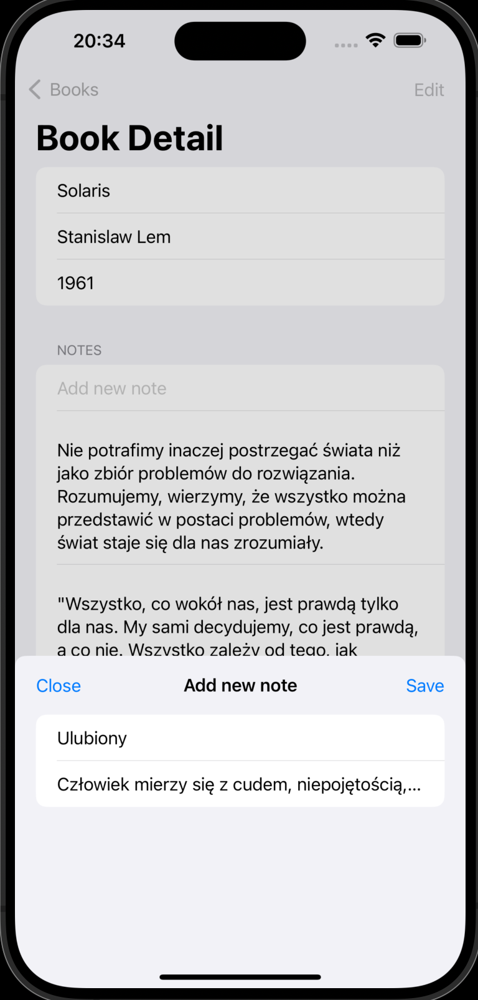

# SwiftData pierwsze kroki

[TOC]


## Wstęp

Apple przedstawiło SwiftData na WWDC 23. Podobnie jak SwiftUI, SwiftData stosuje podejście deklaratywne. SwiftData ułatwia zapisywanie i przechowywanie danych, pozwalając nam modelować i zarządzać danymi za pomocą deklaratywnego kodu, eliminując potrzebę korzystania z plików projektowania schematu modelu (dostępne od wielu lat na IOS CoreData) i wprowadzając kwerendy i filtrowanie danych wyłącznie w kodzie Swift.

SwiftData został zaprojektowany do współpracy zarówno z UIKit, jak i SwiftUI, i doskonale integruje się z SwiftUI. SwiftData jest oparty na Core Data, ale wprowadza nowoczesne podejście do przechowywania danych, dostarczając natywne interfejsy API napisane w języku Swift.

SwiftData wykorzystuje makra do generowania kodu. Makra są kolejną  ciekawą funkcją wprowadzoną na WWDC 23 i służą do generowania szybkiego, wydajnego i bezpiecznego kodu.

SwiftData automatycznie buduje schemat przy użyciu naszych modeli i skutecznie mapuje ich pola do magazynu danych. Obiekty zarządzane przez SwiftData są pobierane z bazy danych w razie potrzeby i automatycznie zapisywane w odpowiednim momencie, bez dodatkowej pracy z naszej strony.

Aby lepiej zrozumieć to zagadnienie, skoncentrujmy się na stworzeniu aplikacji przy użyciu SwiftData. Aplikacja ta będzie służyła do śledzenia przeczytanych przez nas książek i posiadać będzie sekcję notatek dla każdej z nich, umożliwiając nam zapisywanie istotnych aspektów danej lektury.


## Model `Book`

Rozpoczniemy od modelu danych. Nasz model do przechowywania informacji o książkach, będzie nosił nazwę "Book".

```swift
import Foundation

final class Book {
    var title: String
    var author: String
    var publishedYear: Int
    
    init(title: String, author: String, publishedYear: Int) {
        self.title = title
        self.author = author
        self.publishedYear = publishedYear
    }
}
```

*(Przy okazji podpowiedz do Xcode: Wybierz nazwe klasy, prawy klawisz myszy i Refactor-> Generate MemberWise Initializer. )*


Aby przekształcić ten model w model SwiftData, wystarczy zaimportować SwiftData.

```swift
import Foundation
import SwiftData
```

Następnie ozdobimy klasę makrem @Model.

```swift
import Foundation
import SwiftData

@Model
final class Book {
    var title: String
    var author: String
    var publishedYear: Int
    
    init(title: String, author: String, publishedYear: Int) {
        self.title = title
        self.author = author
        self.publishedYear = publishedYear
    }
}
```


To makro Model przekształca klasę Swift w przechowywany model zarządzany przez SwiftData. (**Kodu ponizej nie musisz przepisywać !!!**)

```swift
@Model
final class Book {
    internal init(title: String, author: String, publishedYear: Int) {
        self.title = title
        self.author = author
        self.publishedYear = publishedYear
    }
    
    var title: String
    var author: String
    var publishedYear: Int
  // wszystko poniżej jest wygenerowane dzieki makru @Model
@Transient
private var _$backingData: any SwiftData.BackingData<Book> = Book.createBackingData()

public var persistentBackingData: any SwiftData.BackingData<Book> {
    get {
        _$backingData
    }
    set {
        _$backingData = newValue
    }
}

static var schemaMetadata: [SwiftData.Schema.PropertyMetadata] {
  return [
    SwiftData.Schema.PropertyMetadata(name: "title", keypath: \Book.title, defaultValue: nil, metadata: nil),
    SwiftData.Schema.PropertyMetadata(name: "author", keypath: \Book.author, defaultValue: nil, metadata: nil),
    SwiftData.Schema.PropertyMetadata(name: "publishedYear", keypath: \Book.publishedYear, defaultValue: nil, metadata: nil)
  ]
}

init(backingData: any SwiftData.BackingData<Book>) {
  _title = _SwiftDataNoType()
  _author = _SwiftDataNoType()
  _publishedYear = _SwiftDataNoType()
  self.persistentBackingData = backingData
}

@Transient
private let _$observationRegistrar = Observation.ObservationRegistrar()

struct _SwiftDataNoType {
}
```


 Nie potrzebujemy żadnych dodatkowych plików ani narzędzi do zarządzania modelem danych ani warstwą przechowywania danych. Dodatkowo SwiftData może automatycznie wywnioskować wiele relacji, korzystając z deklaracji, takich jak @Attribute(.unique), aby opisać reguły integralności dla naszych modeli danych.

W przypadku Core Data musimy zainicjować kontener danych, aby uzyskać kontekst modelu, ale w przypadku SwiftData otrzymujemy go za darmo, o ile tworzymy i przekazujemy obiekt ModelContainer. ModelContainer to obiekt zarządzający schematem aplikacji i konfiguracją przechowywania modelu.

W naszym przypadku przekażemy ten kontener z poziomu struktury App.

```swift
import SwiftUI
import SwiftData

@main
struct SwiftDataFirstBloodApp: App {
    var body: some Scene {
        WindowGroup {
            ContentView()
                .modelContainer(for: Book.self)
        }
    }
}
```


### Dopisywanie nowej ksiązki `AddNewBookView`

Dodajmy widok do dodawania nowej książki do naszej aplikacji. Wybieramy Cmd+N, następnie SwiftUI View i w nazwie wpisujemy: `AddNewBookView`

Zaczniemy od importu SwiftData.

```swift
import SwiftUI
import SwiftData

struct AddNewBookView: View {
    var body: some View {
        Text("Hello, World!")
    }
}

#Preview {
    AddNewBookView()
}
```

Oto reszta interfejsu użytkownika (UI), która pozwala na dodawanie nowej książki do naszej listy czytanych książek. Ten kod zawiera pola do wprowadzenia tytułu, autora i roku publikacji, a także przyciski "Anuluj" i "Zapisz" do zarządzania operacjami.

```swift
import SwiftUI
import SwiftData

struct AddNewBookView: View {
    @Environment(\.modelContext) private var context
    @Environment(\.dismiss) private var dismiss

    @State private var title: String = ""
    @State private var author: String = ""
    @State private var publishedYear: Int?
    var body: some View {

        NavigationStack {
            VStack( alignment: .leading){
                Text("Book title:")
                TextField("Enter title",text: $title)
                    .textFieldStyle(.roundedBorder)

                Text("Author:")
                TextField("Enter book author",text: $author)
                    .textFieldStyle(
                        .roundedBorder)

                Text("Published:")
                TextField(
                    "Enter published year",
                    value: $publishedYear,
                    format: .number
                )
                .textFieldStyle(.roundedBorder)
                .keyboardType(.numberPad)

                HStack {

                    Button("Cancel", role: .destructive) {
                        dismiss()
                    }
                    .buttonStyle(.bordered)

                    Spacer()

                    Button("Save") {
                        guard let publishedYear = publishedYear else { return }
                        let book = Book(title: title, author: author, publishedYear: publishedYear)

                        context.insert(book)

                        do {
                            try context.save()
                        } catch {
                            print(error.localizedDescription)
                        }

                        dismiss()
                    }
                    .buttonStyle( .bordered )
                    .disabled(!isFormValid)
                }
                Spacer()
            }
            .padding()
            .navigationTitle("Add New Book")
        }
    }

    private var isFormValid: Bool {
        !title.isEmpty && !author.isEmpty && publishedYear != nil
    }
}

#Preview {
    AddNewBookView()
        .modelContainer(for: [Book.self])
}

```

Ten kod definiuje widok (`View`), który pozwala użytkownikowi wprowadzić informacje o nowej książce, takie jak tytuł, autor i rok publikacji. Wprowadzone dane są przechowywane w zmiennych stanu (`@State`), a przyciski "Anuluj" i "Zapisz" pozwalają na zarządzanie operacjami anulowania i zapisywania nowej książki. Widok ten jest dodatkowo umieszczony w nawigacyjnym stosie (`NavigationStack`) i ma tytuł "Dodaj Nową Książkę".


Mamy już przygotowany interfejs użytkownika (UI), więc teraz dodajmy część związana z SwiftData, która pomoże nam zapisać wprowadzone informacje. Ponieważ przekazujemy kontener modeli za pomocą App, możemy uzyskać dostęp do obiektu środowiskowego (`@Environment`) w celu uzyskania dostępu do kontekstu modelu.

```swift
import SwiftUI
import SwiftData

struct AddNewBookView: View {
    @Environment(\.modelContext) private var context
    
    @State private var title: String = ""
    @State private var author: String = ""
    @State private var publishedYear: Int?
   ...
```

Dodajmy to do naszego widoku `AddNewBookView` (upewnij się, że zaimportowano SwiftData). Musimy również dodać sposób na zamknięcie tego widoku, ponieważ zostanie on prezentowany jako arkusz. Skorzystajmy z funkcji dismiss z obiektu środowiskowego (`@Environment`), aby zamknąć ten widok.

```swift
@Environment(\.dismiss) private var dismiss
```

Dodajmy to również do pliku (upewnij się, że jest zaimportowany SwiftUI i SwiftData). Chcemy upewnić się, że wszystkie informacje związane z książką zostały wprowadzone przez użytkownika, zanim włączymy przycisk "Zapisz". Dlatego napiszemy prostą właściwość obliczeniową do sprawdzania poprawności formularza wprowadzania.

```swift
import SwiftUI
import SwiftData

struct AddNewBookView: View {
    @Environment(\.modelContext) private var context
    @Environment(\.dismiss) private var dismiss
    
    @State private var title: String = ""
    @State private var author: String = ""
    @State private var publishedYear: Int?
    
    private var isFormValid: Bool {
        // Tutaj możesz dodać kod sprawdzający poprawność wprowadzonych danych
        // Zwróć true, jeśli dane są poprawne, w przeciwnym razie false
        return true // Zmień to na właściwą logikę
    }
    
    // ...
}
```

To jest początkowy kod, który pozwala na dostęp do kontekstu modelu (`context`) i funkcji zamknięcia widoku (`dismiss`). Właściwość `isFormValid` jest obecnie zawsze ustawiona na `true`. Musisz dostosować tę właściwość, aby uwzględniała warunki poprawności formularza wprowadzania danych, na przykład sprawdzając, czy wszystkie pola są wypełnione.

Chcemy upewnić się, że użytkownik wprowadzi wszystkie informacje dotyczące książki, zanim włączymy przycisk "Zapisz", dlatego napiszemy prostą funkcję, aby sprawdzić poprawność danych tego formularza.

```swift
private var isValid: Bool {
    !title.isEmpty && !author.isEmpty && publishedYear != nil
}
```

Dodajmy funkcjonalność zapisywania do przycisku "Save".

```swift
Button("Save") {
    guard let publishedYear = publishedYear else { return }
    let book = Book(title: title, author: author, publishedYear: publishedYear)
    
    context.insert(book)
    
    do {
        try context.save()
    } catch {
        print(error.localizedDescription)
    }
    
    dismiss()
}
.buttonStyle(
    .bordered
)
.disabled(!isValid)
```

Ten kod sprawdza, czy wszystkie wymagane pola są wypełnione, a także tworzy i zapisuje nową książkę w bazie danych, gdy użytkownik naciśnie przycisk "Save".

Dodatkowo obsłużymy operacje anulowania. Dodajemy wywołanie funkcji dismiss w bloku akcji przycisku "Cancel", aby zamknąć ten widok.

```swift
Button("Cancel",role: .destructive) {
    dismiss()
}
.buttonStyle(
    .bordered
)
```


Udało nam się zapisać książkę, ale w tym momencie nie mamy sposobu, aby zobaczyć wszystkie zapisane książki, i to jest kolejne wyzwanie: 

### Lista książek `BookListView`

Zacznijmy od stworzenia widoku do wyświetlania listy książek. Cmd+N, wybieramy SwiftUI View i nazywamy go `BookListView`

```swift
import SwiftUI
import SwiftData

struct BookListView: View {
    @Query private var books: [Book]

    var body: some View {
        NavigationStack {
            List {
                ForEach(books) { book in
                    Text(book.title)
                }
            }
            .navigationBarTitle("Books")
        }
    }
}
```

Następnie zaktualizuj plik zawartości  `ContentView.swift`, aby zawierał nowo utworzony widok `BookListView`.

```swift
import SwiftUI

struct ContentView: View {
    var body: some View {
        BookListView()
    }
}

#Preview {
    ContentView()
}
```

W powyższym kodzie mamy widok `BookListView`, który używa `@Query`, aby pobrać listę książek z bazy danych i wyświetlić je w formie listy. Następnie w widoku `ContentView`, który jest głównym widokiem naszej aplikacji, dodajemy `BookListView` jako jego treść. Teraz `BookListView` będzie wyświetlane jako część aplikacji.

```swift
import SwiftUI

struct ContentView: View {
    @State private var presentAddNew = false
    var body: some View {
        VStack {
            BookListView()
            
            Button("Add new book") {
                presentAddNew.toggle()
            }
            .sheet(isPresented: $presentAddNew, content: {
                AddNewBookView()
            })
        }
    }
}

#Preview {
    ContentView()
}
```


Nasza lista książek wyświetla tylko nazwę książki, ale nie wyświetla innych informacji, więc ulepszmy komórkę listy, aby wyświetlać więcej informacji.

```swift
import SwiftUI
import SwiftData

struct BookListView: View {
    @Query private var books: [Book]

    var body: some View {
        NavigationView {
            List {
                ForEach(books) { book in
                    VStack(alignment: .leading) {
                        Text(book.title)
                            .bold()
                        HStack {
                            Text("Autor: \(book.author)")
                            Spacer()
                            Text("Opublikowano: \(book.publishedYear.description)")
                        }
                        .font(.subheadline)
                        .foregroundStyle(.secondary)
                        .padding(.top, 20)
                    }
                }
            }
            .navigationBarTitle("Books")
        }
    }
}

#Preview {
    BookListView()
}
```

Jednak w celu zwiekszenia przejrzystosci kodu, fragment odpowiedzialny za pojedynczy wiersz przeniesiemy do osobnego widoku `BookCellView`

```swift
import SwiftUI

struct BookCellView: View {
    let book: Book
    
    var body: some View {
        VStack(alignment: .leading) {
            Text(book.title)
                .bold()
            HStack {
                Text("Autor: \(book.author)")
                Spacer()
                Text("Opublikowano: \(book.publishedYear.description)")
            }
            .font(.subheadline)
            .foregroundStyle(.secondary)
            .padding(.top, 20)
        }
    }
}
```

Zaktualizujmy teraz widok `BookListView`, aby uwzględniał ten nowo utworzony widok.

```swift
struct BookListView: View {
    @Query private var books: [Book]
    
    var body: some View {
        NavigationStack {
            List {
                ForEach(books) { book in
                    BookCellView(book: book)
                }
            }
            .navigationTitle("Book Diary")
        }
    }
}
```

Teraz lista książek będzie wyświetlać więcej informacji o każdej książce dzięki widokowi `BookCellView`.


Teraz mamy aplikację, która może trwale przechowywać dane za pomocą **SwiftData**, a także możemy przeglądać wszystkie zapisane rekordy między uruchomieniami aplikacji, więc teraz dodamy funkcjonalność usuwania rekordów, abyśmy mogli usunąć rekord ze magazynu danych.

Zacznijmy od przekazania do widoku kontekstu modelu za pomocą obiektu **Environment**, dzięki czemu będziemy mogli pracować nad kontekstem, aby usunąć rekord i zapisać zmiany z powrotem w bazie danych.

```swift
import SwiftUI
import SwiftData

struct BookListView: View {
    @Environment(\.modelContext) private var context
    
    @Query private var books: [Book]
```

Najpierw dodamy prywatną funkcję do widoku, która będzie wykonywać operację usuwania.

```swift
private func delete(indexSet: IndexSet) {
    indexSet.forEach { index in
        let book = books[index]
        context.delete(book)
        
        do {
            try context.save()
        } catch {
            print(error.localizedDescription)
        }
    }
}
```

Teraz przekażmy tę funkcję jako parametr do modyfikatora **onDelete** dla widoku **ForEach**.

```swift
import SwiftUI
import SwiftData

struct BookListView: View {
    @Environment(\.modelContext) private var context
    
    @Query private var books: [Book]
    
    var body: some View {
        NavigationStack {
            List {
                ForEach(books) { book in
                    BookCellView(book: book)
                }
                .onDelete(perform: delete(indexSet:))
            }
            .navigationTitle("Reading Logs")
        }
    }
    
    private func delete(indexSet: IndexSet) {
        indexSet.forEach { index in
            let book = books[index]
            context.delete(book)
            do {
                try context.save()
            } catch {
                print(error.localizedDescription)
            }
        }
    }
}

#Preview {
    BookListView()
        .modelContainer(for: [Book.self])
}

```

Zbuduj i uruchom aplikację na symulatorze, aby dodać nowy rekord do naszego dziennika czytania. Teraz możemy przeciągnąć, aby usunąć rekord z listy. 


Przydałoby się móc modyfikować już wpisane dane:

### Aktualizacja danych `BookDetailView`

Dodajmy funkcjonalność aktualizacji do naszej aplikacji do rejestrowania przeczytanych książek. Rozpoczniemy od stworzenia nowego widoku SwiftUI o nazwie `BookDetailView`, który pozwoli nam zobaczyć szczegóły wybranej książki oraz umożliwi aktualizację tych szczegółów, jeśli będzie to konieczne.

Dodajmy właściwość książki, która zostanie przekazana przy inicjalizacji widoku szczegółowego:

```swift
import SwiftUI

struct BookDetailView: View {
    let book: Book
    
    var body: some View {
        Text("Hello, World!")
    }
}
```

Potrzebujemy także dostępu do kontekstu modelu, aby zapisać zmiany w magazynie danych wraz z możliwością odrzucenia prezentowanego widoku. Obydwa możemy uzyskać za pomocą obiektów środowiska.

```swift
import SwiftUI

struct BookDetailView: View {
    let book: Book
    
    @Environment(\.modelContext) private var context
    @Environment(\.dismiss) private var dismiss
    
    var body: some View {
        Text("Hello, World!")
    }
}
```

Tworzymy kilka właściwości stanu (`@State`), w tym `isEditing`, który będzie wskazywał, czy widok jest w trybie edycji, oraz właściwości `title`, `author` i `publishedYear`, które będą przechowywać informacje o książce. Te wartości zostaną zainicjowane na podstawie przekazanego obiektu książki.

```swift
struct BookDetailView: View {
    let book: Book
    
    @Environment(\.modelContext) private var context
    @Environment(\.dismiss) private var dismiss
    
    @State private var isEditing = false
    
    @State private var title: String = ""
    @State private var author: String = ""
    @State private var publishedYear: Int? = nil
    
    init(book: Book) {
        self.book = book
        self._title = State.init(initialValue: book.title)
        self._author = State.init(initialValue: book.author)
        self._publishedYear = State.init(initialValue: book.publishedYear)
    }
```

Następnie w ciele widoku `BookDetailView` dodajemy formularz (`Form`). Jeśli `isEditing` jest ustawione na `true`, wyświetlamy grupę pól tekstowych (`TextField`), w przeciwnym razie wyświetlamy informacje o książce w polach tekstowych (`Text`). Dodajemy także pasek narzędziowy (`toolbar`), który zawiera przycisk do przełączania stanu edycji widoku.

To pozwoli nam na wyświetlanie i aktualizację informacji o książce w naszej aplikacji.

```swift
struct BookDetailView: View {
    let book: Book
    
    @Environment(\.modelContext) private var context
    @Environment(\.dismiss) private var dismiss
    
    @State private var isEditing = false
    
    @State private var title: String = ""
    @State private var author: String = ""
    @State private var publishedYear: Int? = nil
    
    init(book: Book) {
        self.book = book
        self._title = State.init(initialValue: book.title)
        self._author = State.init(initialValue: book.author)
        self._publishedYear = State.init(initialValue: book.publishedYear)
    }
    
    var body: some View {
        Form {
            if isEditing {
                Group {
                    TextField("Book title", text: $title)
                    TextField("Book author", text: $author)
                    TextField("Published year", value: $publishedYear, formatter: NumberFormatter())
                        .keyboardType(.numberPad)
                }
                .textFieldStyle(.roundedBorder)
            } else {
                Text(book.title)
                Text(book.author)
                Text(book.publishedYear.description)
            }
        }
        .toolbar {
            ToolbarItem(placement: .topBarTrailing) {
                Button(isEditing ? "Done" : "Edit") {
                    isEditing.toggle()
                }
            }
        }
        .navigationTitle("Book Detail")
    }
}
```

Dodajmy teraz funkcjonalność pozwalająca zapisywać dane do bazy:

```swift
                Button("Save") {
                    guard let publishedYear = publishedYear else { return }
                    book.title = title
                    book.author = author
                    book.publishedYear = publishedYear
                    
                    do {
                        try context.save()
                    } catch {
                        print(error.localizedDescription)
                    }
                    
                    dismiss()
                }
```

Całość `BookDetailView` powinna wyglądać tak:

```swift
struct BookDetailView: View {
    let book: Book
    
    @Environment(\.modelContext) private var context
    @Environment(\.dismiss) private var dismiss
    
    @State private var isEditing = false
    
    @State private var title: String = ""
    @State private var author: String = ""
    @State private var publishedYear: Int? = nil
    
    init(book: Book) {
        self.book = book
        self._title = State.init(initialValue: book.title)
        self._author = State.init(initialValue: book.author)
        self._publishedYear = State.init(initialValue: book.publishedYear)
    }
    
    var body: some View {
        Form {
            if isEditing {
                Group {
                    TextField("Book title", text: $title)
                    TextField("Book author", text: $author)
                    TextField("Published year", value: $publishedYear, formatter: NumberFormatter())
                        .keyboardType(.numberPad)
                }
                .textFieldStyle(.roundedBorder)
                Button("Save") {
                    guard let publishedYear = publishedYear else { return }
                    book.title = title
                    book.author = author
                    book.publishedYear = publishedYear
                    
                    do {
                        try context.save()
                    } catch {
                        print(error.localizedDescription)
                    }
                    
                    dismiss()
                }
            } else {
                Text(book.title)
                Text(book.author)
                Text(book.publishedYear.description)
            }
        }
        .toolbar {
            ToolbarItem(placement: .topBarTrailing) {
                Button(isEditing ? "Done" : "Edit") {
                    isEditing.toggle()
                }
            }
        }
        .navigationTitle("Book Detail")
    }
}
```


Będziemy uruchamiać widok szczegółów z widoku `BookCellView`, więc zaktualizujmy ten widok, aby zawierał widok `NavigationLink` i modyfikator `navigationDestination`. Oto, jak możemy to zrobić:

```swift
import SwiftUI

struct BookCellView: View {
    let book: Book
    
    var body: some View {
        NavigationLink(value: book) {
            VStack(alignment: .leading) {
                Text(book.title)
                    .bold()
                HStack {
                    Text("Author: \(book.author)")
                    Spacer()
                    Text("Published on: \(book.publishedYear.description)")
                }
                .font(.subheadline)
                .foregroundStyle(.secondary)
                .padding(.top, 20)
            }
        }
        .navigationDestination(for: Book.self) { book in
            BookDetailView(book: book)
        }
    }
}
```

Teraz w widoku `BookCellView` mamy `NavigationLink`, który przenosi do widoku szczegółów (`BookDetailView`) po naciśnięciu komórki z informacjami o książce. Zastosowaliśmy także modyfikator `navigationDestination`, aby określić, do którego widoku ma prowadzić link i przekazać odpowiednią książkę jako wartość. Teraz, po zbudowaniu i uruchomieniu aplikacji, powinno działać przejście do widoku szczegółów po kliknięciu w komórkę z książką.


Nasz przycisk "Dodaj nową książkę" pojawia się także w widoku szczegółowym książki. Aby to naprawić, przenieśmy go do paska narzędziowego (`toolbar`) widoku nawigacyjnego na stronie listy książek. Oto, jak możemy to zrobić:

```swift
struct BookListView: View {
    @Environment(\.modelContext) private var context
    @Query private var books: [Book]
    @State private var presentAddNew = false
    
    var body: some View {
        NavigationStack {
            List {
                ForEach(books) { book in
                    BookCellView(book: book)
                }
                .onDelete(perform: delete(indexSet:))
            }
            .navigationTitle("Reading Logs")
            .toolbar {
                ToolbarItem(placement: .topBarTrailing) {
                    Button{
                        presentAddNew.toggle()
                    } label: {
                        Image(systemName: "plus.circle.fill")
                    }
                    .buttonStyle(.borderedProminent)
                    .sheet(isPresented: $presentAddNew, content: {
                        AddNewBookView()
                    })
                }
            }
        }
    }
    
    private func delete(indexSet: IndexSet) {
        indexSet.forEach { index in
            let book = books[index]
            context.delete(book)
            
            do {
                try context.save()
            } catch {
                print(error.localizedDescription)
            }
        }
    }
}

#Preview {
    BookListView()
        .modelContainer(for: [Book.self])
}
```

## Uruchommy podglądy 

Jest jeszcze więcej do zrobienia w tej aplikacji, ale w tym momencie chcę zatrzymać się na chwilę, aby rozwiązać nierozstrzygnięty problem: jak sprawić, by podglądy Xcode działały?

Cóż, możesz pomyśleć, że możemy po prostu stworzyć przykładowy obiekt `Book` i po prostu przekazać go, wraz ze stałą ścieżką nawigacyjną. W przypadku `BookDetailView` takie rozwiązanie wyglądałoby tak:

```swift
#Preview {
    let book = Book(title: "Poczytaj mi mamo 1", author: "Julian Tuwim", publishedYear: 1971)

    return BookDetailView(book: book)
        .modelContainer(for: Book.self)
}
```

Jednak ten kod nie działa, ponieważ SwiftData jest podstępny: jak tylko wywołasz inicjalizator Book, po cichu szuka tego, co jest aktualnie aktywnym kontenerem modelu, aby upewnić się, że wszystko jest poprawnie skonfigurowane.

W naszym kodzie podglądu tworzymy kontener modelu dopiero po utworzeniu przykładowej książki, co oznacza, że nasz podgląd nie będzie działał - w rzeczywistości po prostu się wykraczy.

Naprawienie tego oznacza utworzenie kontenera modelu przed utworzeniem przykładowych danych, ale gdy tam jesteśmy, chcemy również włączyć niestandardową opcję konfiguracji, która mówi SwiftData, aby przechowywał swoje dane tylko w pamięci. Oznacza to, że wszystko, co wstawiamy do kontenera modelu, jest tylko tymczasowe, co jest idealne do celów podglądu.

```swift
#Preview {
    do {
        let container: ModelContainer
        let config = ModelConfiguration(isStoredInMemoryOnly: true)
        container = try ModelContainer(for: Book.self, configurations: config)

        let book = Book(title: "Poczytaj mi mamo 1", author: "Julian Tuwim", publishedYear: 1971)
        container.mainContext.insert(book)
        return BookDetailView(book: book)
            .modelContainer(for: Book.self)
    } catch {
        return Text("Failed to create preview: \(error.localizedDescription)")
    }
}
```

To wymaga sporo linii kodu, a ponieważ potrzebujemy go w więcej niż jednym miejscu, zamierzamy wyizolować tę funkcjonalność w nowej strukturze o nazwie `Previewer`. Będzie to miało za zadanie skonfigurowanie przykładowego kontenera i stworzenie niektórych danych z możliwością podglądu, abyśmy mogli użyć tego współdzielonego kodu wszędzie tam, gdzie chcemy, aby podgląd działał.

```swift
import Foundation
import SwiftData


@MainActor
struct Previewer {
    let container: ModelContainer
    let book: Book
    let genre: Genre
    let note: Note

    init() throws {
        let config = ModelConfiguration(isStoredInMemoryOnly: true)
        container = try ModelContainer(for: Book.self, configurations: config)

        book = Book(title: "Poczytaj mi mamo 1", author: "Julian Tuwim", publishedYear: 1971)
        container.mainContext.insert(book)

        genre = Genre(name: "horror")
        genre.books.append(book)
        container.mainContext.insert(genre)

        note = Note(title: "Fajny tekst", message: "Pies ci morde lizał", book: book)
        container.mainContext.insert(note)

    }
}
```

Jest tam kilka ważnych szczegółów, które chcę tam wybrać:

1. Ponieważ główny kontekst SwiftData zawsze działa na głównym wątku, musimy zanotować całą strukturę za pomocą @MainActor, aby upewnić się, że również tam działa.
2. Sprawienie, by SwiftData przechowywał swoje dane w pamięci, oznacza użycie ModelConfiguration. Ma to różne przydatne opcje, ale w tej chwili zależy nam tylko na tym, aby nie przechowywać danych na stałe.
3. Same tworzenie kontenera modelowego jest operacją która może zgłosić wyjątek, więc oznaczyłem cały inicjalizator `throws`, zamiast próbować radzić sobie z błędami wewnątrz tej klasy.
4. Tworzone są dwa przykładowe fragmenty danych, ale tylko jeden jest wstawiany. W porządku - znowu SwiftData wie, że związek tam jest, więc wstawi oba.
5. Kontener danych, książka, gatunek i notatka są przechowywane we właściwościach dla łatwiejszego dostępu zewnętrznego. Uczyniłem je wszystkie stałymi, ponieważ nie ma sensu zmieniać ich po ich utworzeniu.

po tych zmianach nasz prewiever dla wszystkich widokow przyjmujących book jako parametr, można uprościć o kilka linijek kodu:

```swift
#Preview {
    do {
        let previewer = try Previewer()
        return BookDetailView(book: previewer.book)
            .modelContainer(for: Book.self)
    } catch {
        return Text("Failed to create preview: \(error.localizedDescription)")
    }
}
```


##  Model `Notes`. Relacje z innymi danymi

​	Nasz dziennik czytelniczy zawiera spis książek, które dotąd przeczytaliśmy, ale co jeśli chcemy zapamiętać rzeczy, które nam się podobają w książce, na przykład ważne cytaty itp.? Możemy rozwiązać ten problem, dodając możliwość robienia notatek na poziomie książki, dzięki czemu każdy rekord książki będzie miał miejsce na dodawanie notatek o niej.
W tym przypadku łączymy ze sobą dwa rekordy (Książka i Notatka) za pomocą wspólnego ogniwa. To połączenie nazywa się relacją między rekordami. Istnieją różne rodzaje relacji między rekordami.

**Relacja jeden do jeden (1:1):** W relacji jeden do jeden, każdy rekord po jednej stronie relacji jest powiązany dokładnie z jednym rekordem po drugiej stronie, i vice versa. Na przykład możemy mieć rekord "`Osoba`" z relacją jeden do jeden z rekordem "`Paszport`", gdzie każda osoba ma tylko jeden paszport.

**Relacja jeden do wielu (1:N):** W relacji jeden do wielu, każdy rekord po jednej stronie relacji może być powiązany z wieloma rekordami po drugiej stronie, ale każdy rekord po drugiej stronie jest powiązany tylko z jednym rekordem po pierwszej stronie. Na przykład możemy mieć rekord "Dział" z relacją jeden do wielu z rekordem "`Pracownik`", gdzie każdy dział może mieć wielu pracowników, ale każdy pracownik należy tylko do jednego działu.

**Relacja wiele do jeden (N:1):** To jest odwrotność relacji jeden do wielu. Każdy rekord po jednej stronie jest powiązany z jednym rekordem po drugiej stronie, ale każdy rekord po drugiej stronie może być powiązany z wieloma rekordami po pierwszej stronie. Korzystając z tego samego przykładu "`Dział`" i "`Pracownik`", oznaczałoby to, że każdy pracownik należy do jednego działu, ale wiele pracowników może należeć do tego samego działu.

**Relacja wiele do wielu (N:N):** W relacji wiele do wielu, wiele rekordów po jednej stronie może być powiązanych z wieloma rekordami po drugiej stronie. Na przykład możemy mieć rekord "`Student`", rekord "`Kurs`" i rekord "`Rejestracja`", aby reprezentować relację wiele do wielu między studentami a kursami, gdzie każda rejestracja łączy studenta z kursem.

​	W naszym przypadku relacja jest jednostronna, gdzie jedna książka będzie zawierać wiele notatek.
Zacznijmy od stworzenia nowego modelu dla notatki do książki. Będziemy nazywać tę klasę "`Notatka`".

```swift
import Foundation
import SwiftData

@Model
final class Note {
    var title: String
    var message: String
    var book: Book?
    
    init(title: String, message: String, book: Book? = nil) {
        self.title = title
        self.message = message
        self.book = book
    }
}
```


Aby powiązac ten rekord z książka musimy w modelu Book dodać informację o relacji:

```swift
import Foundation
import SwiftData

@Model
final class Book {
    var title: String
    var author: String
    var publishedYear: Int
    
    @Relationship(deleteRule: .cascade, inverse: \Note.book)
    var notes = [Note]()
    
    init(title: String, author: String, publishedYear: Int) {
        self.title = title
        self.author = author
        self.publishedYear = publishedYear
    }
}
```


Zauważ, że ustawiamy `deleteRule` dla tej relacji jako `cascade`, co oznacza, że po usunięciu tej książki wszelkie powiązane modele również zostaną usunięte. Inne reguły usuwania obejmują:

- `noAction`: Reguła, która nie wprowadza zmian w powiązanych modelach.
- `nullify`: Reguła, która ustawia na `null` referencję do powiązanego modelu.
- `deny`: Reguła, która uniemożliwia usunięcie modelu, ponieważ zawiera jedno lub więcej odniesień do innych modeli.
- `cascade`: Reguła, która usuwa wszelkie powiązane modele.

Opcja `inverse` tworzy połączenie między modelem książki a właściwością `book` notatki.


### Widok do dopisywania notatek `AddNewNote`

Po przygotowaniu modeli i ustanowieniu relacji między nimi, możemy zacząć rozwijać nasze widoki. Zaczynamy od utworzenia `AddNewNote` do ktorego przekażemy obiekt Book jako parametr wejściowy i zadeklarujemy 2 zmienne do ktorych beda wpisywane dane:

```swift
import SwiftUI
import SwiftData

struct AddNewNote: View {
      let book: Book
    
    @State private var title: String = ""
    @State private var message: String = ""
  
    var body: some View {
        Text("Hello !")
    }
}
```


dodajemy informacje o kontekscie i zmienną do sterowania formularzem

```swift
struct AddNewNote: View {
    let book: Book
    ...
    @Environment(\.modelContext) private var context
    @Environment(\.dismiss) private var dismiss
      var body: some View {...
         }
```


dodajemy formularz z polami do wprowadzania danych:

```swift
        Form {
            TextField("Note title", text: $title)
            TextField("Note", text: $message)
        }
        .navigationTitle("Add new note")
```


przyciski Save i Close

```swift
        .toolbar {
            ToolbarItem(placement: .topBarLeading) {
                Button("Close") {
                    dismiss()
                }
            }
            
            ToolbarItem(placement: .topBarTrailing) {
                Button("Save") {
                    let note = Note(title: title, message: message)
                    note.book = book
                    context.insert(note)
                    
                    do {
                        try context.save()
                        book.notes.append(note)
                    } catch {
                        print(error.localizedDescription)
                    }
                    
                    dismiss()
                }
            }
        }
```


```swift
struct AddNewNote: View {
    let book: Book
    
    @State private var title: String = ""
    @State private var message: String = ""
    
    @Environment(\.modelContext) private var context
    @Environment(\.dismiss) private var dismiss
    
    var body: some View {
        Form {
            TextField("Note title", text: $title)
            TextField("Note", text: $message)
        }
        .navigationTitle("Add new note")
        .toolbar {
            ToolbarItem(placement: .topBarLeading) {
                Button("Close") {
                    dismiss()
                }
            }
            
            ToolbarItem(placement: .topBarTrailing) {
                Button("Save") {
                    let note = Note(title: title, message: message)
                    note.book = book
                    context.insert(note)
                    
                    do {
                        try context.save()
                        book.notes.append(note)
                    } catch {
                        print(error.localizedDescription)
                    }
                    
                    dismiss()
                }
            }
        }
    }
}
```

### Lista notatek w książce `NotesListView`


Dodajemy widok do wyświetlania listy naszych notatek `NotesListView`:

Obiekt książki zostanie przekazany jako parametr wejściowy tego widoku, a my użyjemy widoku List i ForEach do wyrenderowania listy notatek na temat książki.

```swift
import SwiftUI
import SwiftData

struct NotesListView: View {
    let book: Book

    var body: some View {
        List {
            ForEach(book.notes) { note in

                VStack {
                    Text(note.title)
                        .bold()
                    Text(note.message)

                }
            }
        }
    }
}
```

Dodajmy ten widok jako sekcję do widoku szczegółowego książki.

Zacznij od dodania nowego właściwości stanu (`@State` property) w celu przełączania arkusza do dodawania nowej notatki w widoku `BookDetailView`:

```swift
@State private var showAddNewNote = false
```

Następnie stwórz nową sekcję pod formularzem dla notatek:

```swift
struct BookDetailView: View { 
  @State private var showAddNewNote = false
  ...
var body: some View {
    Form {
        if isEditing {
            // ...
        } else {
            // ...
        }
        
        Section("Notes") {
            Button("Add new note") {
                showAddNewNote.toggle()
            }
            .sheet(isPresented: $showAddNewNote, content: {
                NavigationStack {
                    AddNewNote(book: book)
                }
            })
        }
    }
}
```

Ponieważ widok dodawania nowej notatki ma tylko dwie pola, byłoby rozsądne, aby zajmował tylko część ekranu, a nie uruchamiał się jako pełny arkusz. Możemy to osiągnąć, korzystając z "presentation detents". Wyłączmy również funkcję przeciągnięcia do zamknięcia arkusza, dzięki czemu użytkownik może zamknąć widok dodawania notatki tylko poprzez naciśnięcie jednego z przycisków w nim dostępnych.

```swift
Section("Notes") {
                Button("Add new note") {
                    showAddNewNote.toggle()
                }
                .sheet(isPresented: $showAddNewNote, content: {
                    NavigationStack {
                        AddNewNote(book: book)
                    }
                    .presentationDetents([.fraction(0.3)])
                    .interactiveDismissDisabled()
                })
                
            }
```


Jesteśmy gotowi, aby wyświetlić wszystkie notatki powiązane z bieżącą książką. Podczas wyświetlania notatek miałoby sens pokazać pusty stan, aby poinformować użytkownika, że nie ma notatek, jeśli jeszcze nie dodał żadnych notatek do książki. W tym celu użyjemy widoku `ContentUnavailable`.

```swift
Section("Notes") {
    Button("Add new note") {
        showAddNewNote.toggle()
    }
    .sheet(isPresented: $showAddNewNote, content: {
        NavigationStack {
            AddNewNote(book: book)
        }
        .presentationDetents([.fraction(0.3)])
        .interactiveDismissDisabled()
    })

    if book.notes.isEmpty {
        ContentUnavailableView("No notes", systemImage: "note")
    } else {
        NotesListView(book: book)
    }
}
```

Zbuduj i uruchom aplikację, aby zobaczyć to w działaniu.



Teraz mamy możliwość dodawania notatek do książek, ale co jeśli wprowadzimy notatkę przez pomyłkę? Nie byłoby miło móc ją usunąć? Dla tego celu dodajmy funkcję usuwania notatki do listy notatek.

Przejdź z powrotem do widoku `NotesListView` i dodaj zmienną środowiskową (`@Environment(\.modelContext) private var context`) dla dostępu do kontekstu modelu. Następnie dodajmy prywatną funkcję do obsługi operacji usuwania.

```swift
struct NotesListView: View {
    let book: Book
    @Environment(\.modelContext) private var context
    
private func deleteNote(indexSet: IndexSet) {
        indexSet.forEach { index in
            let note = book.notes[index]
            context.delete(note)
            book.notes.remove(at: index)
            do {
                try context.save()
            } catch {
                print(error.localizedDescription)
            }
        }
    }
    
    var body: some View {
        // ... reszta widoku
    }
}
```

Teraz możemy wywołać tę funkcję w widoku, gdzie użytkownik ma możliwość usuwania notatek, używając `.onDelete(perform: deleteNote)`. Na przykład:

```swift
List {
    ForEach(book.notes, id: \.self) { note in
        // Wyświetl notatkę
    }
    .onDelete(perform: deleteNote)
}
```

W ten sposób użytkownik będzie mógł usuwać notatki z listy, przeciągając w lewo na notatce lub używając przycisku "Edytuj" i naciskając czerwony przycisk "Usuń". Pamiętaj, że operacje usuwania powinny być ostrożnie obsługiwane, aby uniknąć przypadkowego usunięcia ważnych danych.

cały widok:

```swift
import SwiftUI
import SwiftData

struct NotesListView: View {
    let book: Book
    @Environment(\.modelContext) private var context

    var body: some View {
        List {
            ForEach(book.notes) { note in

                VStack {
                    Text(note.title)
                        .bold()
                    Text(note.message)

                }
            }
            .onDelete(perform: deleteNote(indexSet:))
        }
    }

    private func deleteNote(indexSet: IndexSet) {
            indexSet.forEach { index in
                let note = book.notes[index]
                context.delete(note)
                book.notes.remove(at: index)
                do {
                    try context.save()
                } catch {
                    print(error.localizedDescription)
                }
            }
        }
}
```


## Model Genre - rozbudowa o gatunek literacki

Książki są podzielone na gatunki literackie, dlatego logiczne byłoby, gdyby nasz dziennik książek zawierał klasyfikację gatunkową, która pomogłaby nam śledzić liczbę przeczytanych przez nas książek fikcyjnych i niefikcyjnych.
Biorąc pod uwagę, że gatunek może obejmować wiele książek i odwrotnie, książkę można powiązać z wieloma gatunkami literackimi, ten scenariusz oferuje doskonałą okazję do przetestowania, w jaki sposób SwiftData zarządza relacją wiele do wielu (N:N).
Zaczniemy od dodania nowego modelu do naszego projektu.

```swift
import Foundation
import SwiftData

@Model
final class Genre {
    var name: String
    var books = [Book]()
    
    init(name: String) {
        self.name = name
    }
}
```

Zaktualizujmy także model książki, aby uwzględnić relację między modelami gatunku i książki.
Relacja między książką a gatunkiem będzie opierać się na zasadzie zerowania usuwanych relacji `nullify delete rule`, zasadniczo unieważniając odniesienie powiązanego modelu do usuniętego modelu. Definiując tę regułę usuwania, gwarantujemy, że w przypadku usunięcia książki nie zostanie usunięta kategoria gatunku.


```swift
import Foundation
import SwiftData

@Model
final class Book {
    ...
    
    @Relationship(deleteRule: .nullify, inverse: \Genre.books)
    var genres = [Genre]()
    
    init(title: String, author: String, publishedYear: Int) {
     ...
    }
}
```


### Lista gatunków literackich `GenreListView`

Dodajmy widok pokazujący wszystkie gatunki. Będziemy używać makra `Query` do pobrania rekordów przechowywanych w tabeli `Genre`.

```swift
import SwiftUI
import SwiftData

struct GenreListView: View {
    
    @Query(sort: \Genre.name) private var genres: [Genre]
    
    var body: some View {
        NavigationStack {
            List {
                ForEach(genres) { genre in
                    Text(genre.name)
                }
            }
            .navigationTitle("Literary Genres")
        }
    }
}

#Preview {
    GenreListView()
}
```

Następnie dodamy ten widok do ContentView. Nasza aplikacja wyświetli książki i gatunki w widoku TabView.

```swift
import SwiftUI

struct ContentView: View {
    var body: some View {
        TabView {
            BookListView()
                .tabItem {
                    Image(systemName: "books.vertical.fill")
                    Text("Books")
                }
            GenreListView()
                .tabItem {
                    Image(systemName: "gear.circle")
                    Text("Genre")
                }
        }
    }
}

#Preview {
    ContentView()
}
```


### Dodawanie gatunków literackich `AddNewGenre`

Następnie dodamy widok umożliwiający utworzenie nowej kategorii gatunku. Ten widok będzie prezentowany jako dolny arkusz i będzie miał pojedynczy widok TextField, w którym można dodać nowy gatunek.

```swift
import SwiftUI
import SwiftData

struct AddNewGenre: View {
    @State private var name: String = ""
    
    @Environment(\.modelContext) private var context
    @Environment(\.dismiss) private var dismiss
    
    var body: some View {
        NavigationStack {
            VStack {
                TextField("Add New Genre", text: $name)
                    .textFieldStyle(.roundedBorder)
                    .navigationTitle("Add New Genre")
                    .padding(.horizontal)
                
                HStack {
                    Button("Save") {
                        let genre = Genre(name: name)
                        context.insert(genre)
                        do {
                            try context.save()
                        } catch {
                            print(error.localizedDescription)
                        }
                        dismiss()
                    }
                    .buttonStyle(.borderedProminent)
                    
                    Button("Cancel") {
                        dismiss()
                    }
                    .buttonStyle(.bordered)
                }
                
                Spacer()
            }
        }
    }
}

#Preview {
    AddNewGenre()
}
```

Dodajmy punkt uruchamiania widoku `AddNewGenre`. Uruchomimy ten widok z `GenreListView`, więc dodajmy zaraz po navigationTitle nowy `ToolBarItem`.

```swift
            .toolbar {
                ToolbarItem(placement: .topBarTrailing) {
                    Button{
                        presentAddNew.toggle()
                    } label: {
                        Image(systemName: "plus.circle.fill")
                    }
                    .buttonStyle(.borderedProminent)
                    .sheet(isPresented: $presentAddNew, content: {
                        AddNewGenre()
                            .presentationDetents([.fraction(0.3)])
                            .interactiveDismissDisabled()
                    })
                }
            }
```

 Deklarujemy też zmienną `presentAddNew` sterująca pokazywaniem arkusza do wprowadzania gatunku.

```swift
import SwiftUI
import SwiftData

struct GenreListView: View {
    
    ...
    
    @State private var presentAddNew = false
    
    var body: some View {
        NavigationStack {
            ...
            .navigationTitle("Literary Genres")
            .toolbar {
                ToolbarItem(placement: .topBarTrailing) {
                    Button{
                        presentAddNew.toggle()
                    } label: {
                        Image(systemName: "plus.circle.fill")
                    }
                    .buttonStyle(.borderedProminent)
                    .sheet(isPresented: $presentAddNew, content: {
                        AddNewGenre()
                            .presentationDetents([.fraction(0.3)])
                            .interactiveDismissDisabled()
                    })
                }
            }
        }
    }
}

#Preview {
    GenreListView()
}
```

Dodajmy od razu funkcjonalnośc usuwania rekordów z listy:

1. Będziemy potrzebować dostępu do kontekstu modelu w GenreListView, aby wykonać operację usuwania. 

   - ```swift
     @Environment(\.modelContext) private var context
     ```

     

2. Następnie dodamy prywatną funkcję usuwania gatunku z listy

   - ```swift
     private func deleteGenre(indexSet: IndexSet) {
             indexSet.forEach { index in
                 let genreToDelete = genres[index]
                 context.delete(genreToDelete)
                 do {
                     try context.save()
                 } catch {
                     print(error.localizedDescription)
                 }
             }
         }
     ```

     

3. Wywołajmy tę funkcję za pomocą modyfikatora onDelete w widoku ForEach.

   - ```swift
         var body: some View {
             NavigationStack {
                 List {
                     ForEach(genres) { genre in
                         Text(genre.name)
                     }
                     .onDelete(perform: deleteGenre(indexSet:))
                 }
                 ...
             }
         }
     ```

     

   

### Przypisywanie gatunków do książki 

Teraz, gdy mamy funkcjonalne widoki na książki i gatunki, czas połączyć je w całość.
Zaczniemy od utworzenia nowego widoku `GenreSelectionView`, do renderowania elementów sterujących wyborem gatunku, co pozwoli nam uwzględnić ten widok jako widok podrzędny w widoku `AddNewBookView`. Użyjemy makra `Query`, aby pobrać wszystkie rekordy z gatunku.

```swift
import SwiftUI
import SwiftData

struct GenreSelectionView: View {
    @Query(sort: \Genre.name) private var genres: [Genre]
```

Potrzebujemy również zmiennej do przechowywania wszystkich wybranych wartości, dodamy jej atrybut Binding, aby utworzyć dwukierunkowe połączenie między właściwością przechowującą dane a UI.
Ponieważ książka może należeć do wielu gatunków jednocześnie, utworzymy wybrane gatunki jako typ `Set<Genre>`.

```swift
struct GenreSelectionView: View {
    @Query(sort: \Genre.name) private var genres: [Genre]
    @Binding var selectedGenres: Set<Genre>
```

Wyświetlimy gatunki w widoku listy i wyświetlimy pole wyboru obok nazwy gatunku, aby pokazać wybór. Dodamy także `onTapGesture` do zaznaczania i odznaczania gatunku.

```swift
import SwiftUI
import SwiftData

struct GenreSelectionView: View {
    @Query(sort: \Genre.name) private var genres: [Genre]
    @Binding var selectedGenres: Set<Genre>

    var body: some View {
        List {
            Section("Literary Genres") {
                ForEach(genres) { genre in
                    HStack {
                        Text(genre.name)
                        Spacer()
                        Image(systemName: selectedGenres.contains(genre) ? "checkmark.circle.fill" : "circle.dashed")
                    }
                    .contentShape(Rectangle())
                    .onTapGesture {
                        if !selectedGenres.contains(genre) {
                            selectedGenres.insert(genre)
                        } else {
                            selectedGenres.remove(genre)
                        }
                    }
                }
            }

        }
        .listStyle(.plain)
    }
}
```

Dodajmy ten widok do `AddNewBookView`. Zaczniemy od dodania najpierw właściwości State, aby zapewnić powiązanie dla wybranych gatunków.

```swift
import SwiftUI
import SwiftData

struct AddNewBookView: View {
    ...
    
    @State private var selectedGenres = Set<Genre>()
```

Następnie dodamy `GenreSelectionView` bezpośrednio nad przyciskami anulowania i zapisu w widoku `AddNewBookView`.

```swift
struct AddNewBookView: View {
    ...
    
    @State private var selectedGenres = Set<Genre>()
    
    ...
    
    var body: some View {
        NavigationStack {
            VStack(alignment: .leading) {
                ...
                
                GenreSelectionView(selectedGenres: $selectedGenres)
                
                HStack {
                   ...
                    }
                    .buttonStyle(.bordered)
                    .disabled(!isValid)
                }
                
                Spacer()
            }
            .padding()
            .navigationTitle("Add New Book")
        }
    }
}
```


Chcemy także mieć pewność, że zapiszemy wybrane gatunki wraz z książką i gatunkiem powiązanym z książką, dlatego zaktualizujmy działanie przycisku zapisu, aby uwzględnić tę opcję. Poniższy kod dodajmy przed `context.insert(book)` 

```swift
book.genres = Array(selectedGenres)
selectedGenres.forEach { genre in
                        genre.books.append(book)
                        context.insert(genre)
                       }
```

Po zapisaniu gatunku potrzebujemy sposobu, aby wyświetlić go razem z książką, więc popracujmy nad tym dalej.
Otwórzmy `BookDetailView` i pod szczegółami książki dodajmy `HStack`, aby pokazać gatunek powiązany z książką.

```swift
import SwiftUI

struct BookDetailView: View {
    ...
    var body: some View {
        Form {
            if isEditing {
                ...
            } else {
                Text(book.title)
                Text(book.author)
                Text(book.publishedYear.description)

                if !book.genres.isEmpty {
                    HStack {
                        ForEach(book.genres) { genre in
                            Text(genre.name)
                                .font(.caption)
                                .padding(.horizontal)
                                .background(.green.opacity(0.3), in: Capsule())
                        }
                    }
                }
            }
            ...
    }
}
```


Mamy możliwość dodania gatunku do nowej książki, ale co z istniejącymi książkami, które zostały dodane przed tą zmianą? Cóż, dodajmy tę funkcjonalność, aktualizując BookDetailView.
Zaczniemy od utworzenia właściwości State do przechowywania wybranych gatunków.

```swift
struct BookDetailView: View {
    ...
    
    @State private var selectedGenres = Set<Genre>()
```

Książka może już należeć do gatunku, więc musimy zachować te wybory, więc zaktualizujmy init, aby uwzględnić wcześniej wybrane gatunki w zmiennej wybranego gatunku.

```swift
struct BookDetailView: View {
    ...
    
    @State private var selectedGenres = Set<Genre>()
    
    init(book: Book) {
       ...
        self._selectedGenres = State.init(initialValue: Set(book.genres))
    }
```

Następnie dodamy `GenreSelectionView` w stanie edycji dla widoku i zaktualizujemy funkcję zapisywania, aby zapisać wybór użytkownika.

```swift
import SwiftUI

struct BookDetailView: View {
   ...
    @State private var selectedGenres = Set<Genre>()
    
    init(book: Book) {
       ... 
        self._selectedGenres = State.init(initialValue: Set(book.genres))
    }
    
    var body: some View {
        Form {
            if isEditing {
                Group {
                    TextField("Book title", text: $title)
                    TextField("Book author", text: $author)
                    TextField("Published year", value: $publishedYear, formatter: NumberFormatter())
                        .keyboardType(.numberPad)
                    
                    GenreSelectionView(selectedGenres: $selectedGenres)
                        .frame(height: 300)
                }
                .textFieldStyle(.roundedBorder)
                Button("Save") {
                    guard let publishedYear = publishedYear else { return }
                    book.title = title
                    book.author = author
                    book.publishedYear = publishedYear
                    
                    book.genres = []
                    book.genres = Array(selectedGenres)
                    selectedGenres.forEach { genre in
                        if !genre.books.contains(where: { b in
                            b.title == book.title
                        }) {
                            genre.books.append(book)
                        }
                    }
                    ...
                }
            } else {
               ...
            }
            ...
}
```

z rozpędu dodajmy wyswietlanie gatunków na liscie książek:

```swift
struct BookCellView: View {
    let book: Book
    
    var body: some View {
        NavigationLink(value: book) {
            VStack(alignment: .leading) {
                Text(book.title)
                    .bold()
                HStack {
                    Text("Author: \(book.author)")
                    Spacer()
                    Text("Published on: \(book.publishedYear.description)")
                }
                .font(.subheadline)
                .foregroundStyle(.secondary)
                .padding(.top, 20)

                if !book.genres.isEmpty {
                    HStack {
                        ForEach(book.genres) { genre in
                            Text(genre.name)
                                .font(.caption)
                                .padding(.horizontal)
                                .background(.green.opacity(0.3), in: Capsule())
                        }
                    }
                }
            }
        }
        .navigationDestination(for: Book.self) { book in
            BookDetailView(book: book)
        }
    }
}
```


### Lista książek przypisanych do wybranego gatunku `GenreDetailView`

Dla każdej książki podajemy gatunki, ale byłoby lepiej, gdybyśmy mogli zobaczyć także książki w ramach każdego gatunku. Zacznijmy więc od utworzenia nowego widoku SwiftUI zawierającego szczegóły gatunku, nazwijmy go `GenreDetailView`.
Zaimportujmy także SwiftData.
Utwórz `let genre: Genre:` właściwość, która będzie używana do przekazywania wybranego przez użytkownika gatunku, którego szczegóły zostaną wyświetlone w widoku.

```swift
import SwiftUI
import SwiftData

struct GenreDetailView: View {
    let genre: Genre
    
    var body: some View {
        Text("Hello, World!")
    }
}
```

Zaktualizujmy `GenreListView`, aby zawierał link nawigacyjny. Użyjemy tego łącza nawigacyjnego, aby przekazać wybrany przez użytkownika gatunek, aby można go było wykorzystać w widoku szczegółów.

```swift
import SwiftUI
import SwiftData

struct GenreListView: View {
    ...
    
    var body: some View {
        NavigationStack {
            List {
                ForEach(genres) { genre in
                    NavigationLink(value: genre) {
                        Text(genre.name)
                    }
                    .navigationDestination(for: Genre.self) { genre in
                        GenreDetailView(genre: genre)
                    }
                }
                .onDelete(perform: deleteGenre(indexSet:))
                
            }
.....
```

Następnie zaktualizujemy `GenreDetailView`, aby wyrenderować listę książek należących do wybranego gatunku. Do wyświetlenia stanu pustego użyjemy `ContentUnavailableView`. Użyjemy widoku listy do renderowania książek w ramach wybranego gatunku i wyświetlimy nazwę wybranego gatunku jako tytuł tego widoku.

```swift
/Users/uta/Library/Containers/com.swiftLee.RocketSim/Data/tmp/RocketSim_Recording_iPhone_15_Pro_Max_6.7_2023-12-19_10.45.58.gifimport SwiftUI
import SwiftData

struct GenreDetailView: View {
    let genre: Genre
    
    var body: some View {
        VStack {
            Group {
                if genre.books.isEmpty {
                    ContentUnavailableView("No data", systemImage: "square.stack.3d.up.slash"
                    )
                } else {
                    List(genre.books) { book in
                        Text(book.title)
                    }
                }
            }
            .navigationTitle(genre.name)
        }
    }
}
```


## Okładka książki - przechowywanie zdjęć


Zmiana jest immanentną cechą używanego systemu informatycznego, więc zobaczmy, jak SwiftData radzi sobie ze zmianą. Nasza aplikacja wygląda dobrze, ale brakuje w niej okładek książek, więc je dodajmy.

### Modyfikacja modelu `Book`

Zaczniemy od nowego pola w modelu `Book`. Ponieważ mamy do czynienia z obrazami, będziemy je przechowywać jako typ `Data`.

```swift
import Foundation
import SwiftData

@Model
final class Book {
    var title: String
    var author: String
    var publishedYear: Int
    
    var cover: Data?
```


*Ta właściwość jest oznaczona jako opcjonalna, ponieważ dodajemy nowy atrybut do naszej istniejącej aplikacji, a ta zmiana nie powinna mieć wpływu na wcześniej zapisane dane, o ile dodajemy nową właściwość jako opcjonalną lub z wartością domyślną.*

Obrazy są duże i nie jest dobrym pomysłem przechowywanie ich bezpośrednio w magazynie danych (ze względu na problemy z wydajnością) możemy zdecydować się na przechowywanie tylko odniesienia do obrazu, a rzeczywiste dane obrazu można umieścić gdzie indziej na dysku. Nie musimy tego robić również ręcznie, możemy wykorzystać atrybut makro SwiftData i zdefiniować konfigurację schematu w celu przechowywania danych binarnych obrazu na zewnątrz.

```swift
@Model
final class Book {
    ...
    
    @Attribute(.externalStorage)
    var cover: Data?
```

Dzięki tej zmianie jesteśmy gotowi na przechowywanie okładek książek.

### Modyfikacja okna dodawania książek `AddNewBookView`

Zaktualizujmy widok `AddNewBook`, aby uwzględnić selektor zdjęć, dzięki któremu użytkownicy będą mogli wybierać okładki książek ze swojej biblioteki zdjęć.
Najpierw zaimportuj moduł `PhotosUI`.

```swift
import SwiftUI
import SwiftData
import PhotosUI

struct AddNewBookView: View {
```

Dodaj dwie nowe właściwości State, jedną do powiązania z selektorem zdjęć, a drugą do przechowywania postaci danych wybranego obrazu.

```swift
import SwiftUI
import SwiftData
import PhotosUI

struct AddNewBookView: View {
    ...
    
    @State private var selectedCover: PhotosPickerItem?
    @State private var selectedCoverData: Data?
```

Dodajmy interfejs użytkownika, aby wybrać zdjęcia.

```swift
                HStack {
                    PhotosPicker(
                        selection: $selectedCover,
                        matching: .images,
                        photoLibrary: .shared()
                    ) {
                        Label("Add Cover", systemImage: "book.closed")
                    }
                    .padding(.vertical)
                    
                    Spacer()
                    
                    if let selectedCoverData {

                    } else {
                        Image(systemName: "photo")
                            .resizable()
                            .scaledToFit()
                            .frame(width: 100, height: 100)
                    }
                }
```

Umieszamy to pod  `Text("Author:")` w `AddNewBookView`

```swift
import SwiftUI
import SwiftData
import PhotosUI

struct AddNewBookView: View {
    ...
    
    var body: some View {
        NavigationStack {
            VStack(alignment: .leading) {
                Text("Book title:")
                ...
                
                HStack {
                    PhotosPicker(
                        selection: $selectedCover,
                        matching: .images,
                        photoLibrary: .shared()
                    ) {
                        Label("Add Cover", systemImage: "book.closed")
                    }
                    .padding(.vertical)
                    
                    Spacer()
                    
                    if let selectedCoverData {

                    } else {
                        Image(systemName: "photo")
                            .resizable()
                            .scaledToFit()
                            .frame(width: 100, height: 100)
                    }
                }
                
                Text("Published:")
...
```

powyzszy kod pozwoli nam wybrac zdjęcie z biblioteki zdjęć w telefonie:


Zanim wyświetlimy wybrany obraz, pobierzmy jego dane binarne i wypełnijmy nasze wybraneCoverData. Ta operacja ma charakter asynchroniczny, dlatego użyjemy zadania, aby wyodrębnić dane z wybranego zdjęcia.

```swift
import SwiftUI
import SwiftData
import PhotosUI

struct AddNewBookView: View {
    ...
            .navigationTitle("Add New Book")
            .task(id: selectedCover) {
                if let data = try? await selectedCover?.loadTransferable(type: Data.self) {
                    selectedCoverData = data
                }
            }
        }
    }
}
```

*Zauważ, że używamy funkcji `loadingTransferable` z elementem `photoPickerItem`. Ta funkcja daje nam możliwość konwersji podstawowych danych, a ponieważ `photoPickerItem` jest zgodny z protokołem Transferable, umożliwia naszemu modelowi zaangażowanie się w proces udostępniania i przesyłania danych*

Teraz, gdy mamy już dane w naszym `SelectCoverData`, wrócimy do sekcji selektora i dodamy kod wyświetlający wybrany obraz.

```swift
if let selectedCoverData, 
let image = UIImage(
  data: selectedCoverData) {
  Image(uiImage: image)
  .resizable()
  .scaledToFit()
  .clipShape(.rect(cornerRadius: 10))
  .frame(width: 100, height: 100)

}
```

Zaktualizujmy akcję przycisku Zapisz, aby obsłużyć zapis obrazu okładki książki.

```swift
Button("Save") {
  ...
  book.genres = Array(selectedGenres)

  if let selectedCoverData {
    book.cover = selectedCoverData
  }

  selectedGenres.forEach { genre in
                          genre.books.append(book)
                          context.insert(genre)
                         }
```

kod widoku po zmianach: 

```swift
import SwiftUI
import SwiftData
import PhotosUI

struct AddNewBookView: View {
    @Environment(\.modelContext) private var context
    @Environment(\.dismiss) private var dismiss

    @State private var title: String = ""
    @State private var author: String = ""
    @State private var publishedYear: Int?

    @State private var selectedGenres = Set<Genre>()

    @State private var selectedCover: PhotosPickerItem?
    @State private var selectedCoverData: Data?

    var body: some View {

        NavigationStack {
            VStack( alignment: .leading){
                Text("Book title:")
                TextField("Enter title",text: $title)
                    .textFieldStyle(.roundedBorder)

                Text("Author:")
                TextField("Enter book author",text: $author)
                    .textFieldStyle(
                        .roundedBorder)

                HStack {
                      PhotosPicker(
                          selection: $selectedCover,
                          matching: .images,
                          photoLibrary: .shared()
                      ) {
                          Label("Add Cover", systemImage: "book.closed")
                      }
                      .padding(.vertical)

                      Spacer()

                      if let selectedCoverData,
                            let image = UIImage(
                            data: selectedCoverData) {
                          Image(uiImage: image)
                         .resizable()
                         .scaledToFit()
                         .clipShape(.rect(cornerRadius: 10))
                         .frame(width: 100, height: 100)
                      } else {
                          Image(systemName: "photo")
                              .resizable()
                              .scaledToFit()
                              .frame(width: 100, height: 100)
                      }
                  }
                Text("Published:")
                TextField(
                    "Enter published year",
                    value: $publishedYear,
                    format: .number
                )
                .textFieldStyle(.roundedBorder)
                .keyboardType(.numberPad)

                GenreSelectionView(selectedGenres: $selectedGenres)

                HStack {

                    Button("Cancel", role: .destructive) {
                        dismiss()
                    }
                    .buttonStyle(.bordered)

                    Spacer()

                    Button("Save") {
                        guard let publishedYear = publishedYear else { return }
                        let book = Book(title: title, author: author, publishedYear: publishedYear)

                        if let selectedCoverData {
                          book.cover = selectedCoverData
                        }
                        
                        book.genres = Array(selectedGenres)
                        selectedGenres.forEach { genre in
                            genre.books.append(book)
                            context.insert(genre)
                        }

                        context.insert(book)

                        do {
                            try context.save()
                        } catch {
                            print(error.localizedDescription)
                        }

                        dismiss()
                    }
                    .buttonStyle( .bordered )
                    .disabled(!isFormValid)
                }
                Spacer()
            }
            .padding()
            .navigationTitle("Add New Book")
            .task(id: selectedCover) {
                if let data = try? await selectedCover?.loadTransferable(type: Data.self) {
                    selectedCoverData = data
                }
            }
        }
    }

    private var isFormValid: Bool {
        !title.isEmpty && !author.isEmpty && publishedYear != nil
    }
}

#Preview {
    AddNewBookView()
        .modelContainer(for: [Book.self])
}

```


Nasza aplikacja rozwija się całkiem nieźle. Dodaliśmy funkcję zapisywania okładek książek, ale nadal musimy zaimplementować metodę weryfikacji, czy okładkę można pobrać z dysku. Skupmy się na włączeniu zapisanej okładki książki do `BookListView` i wyświetleniu jej obok odpowiedniej książki.

### Wyświetlanie obrazu w liscie książek `BookCellView`

Ponieważ większość naszej logiki wyświetlania należy do BookCellView, zaktualizujemy to, aby uwzględnić pobrany obraz z bazy danych.

```swift
struct BookCellView: View {
    let book: Book
    
    var body: some View {
        NavigationLink(value: book) {
            HStack(alignment: .top) {
                if let cover = book.cover, let image = UIImage(data: cover) {
                    Image(uiImage: image)
                        .resizable()
                        .scaledToFit()
                        .clipShape(.rect(cornerRadius: 5))
                        .frame(height: 100)
                }
                VStack(alignment: .leading) {
                    Text(book.title)
                        .bold()
                    Group {
                        Text("Author: \(book.author)")
                        Text("Published on: \(book.publishedYear.description)")
                    }
                    .font(.subheadline)
                    .foregroundStyle(.secondary)
                }
            }
        }
        .navigationDestination(for: Book.self) { book in
            BookDetailView(book: book)
        }
    }
}
```


### Dodawanie okładek w istniejących książkach - `BookDetailView`

Teraz dodamy obsługę dodawania obrazu do istniejącego wpisu w książce w widoku `BookDetailView`.

jest ono bardzo poodbne do tego co zrobilismy przy widoku `AddNewBookView`. Zacznijmy od importu PhotosUI wraz z SwiftData oraz dodania właściwości State dla wybranych okładek książek.

```swift
import SwiftUI
import SwiftData
import PhotosUI

struct BookDetailView: View {
    ...
    
    @State private var selectedCover: PhotosPickerItem?
    @State private var selectedCoverData: Data?
```

Następnie zaraz za polami tekstowymi z danymi książki, dodamy HStack, aby wyświetlić photoPicker, dzięki czemu użytkownik będzie mógł wybrać okładkę książki.

```swift
HStack {
  PhotosPicker(
    selection: $selectedCover,
    matching: .images,
    photoLibrary: .shared()
  ) {
    Label("Add Cover", systemImage: "book.closed")
  }
  .padding(.vertical)

  Spacer()

  if let selectedCoverData,
  let image = UIImage(
    data: selectedCoverData) {
    Image(uiImage: image)
    .resizable()
    .scaledToFit()
    .clipShape(.rect(cornerRadius: 10))
    .frame(width: 100, height: 100)

  } else {
    Image(systemName: "photo")
    .resizable()
    .scaledToFit()
    .frame(width: 100, height: 100)
  }
}
```

Dodajmy `Task` do przetwarzania photoPickerItem do obiektu blob danych, abyśmy mogli go przechowywać za pomocą SwiftData.

```swift
struct BookDetailView: View {
   ...
    
    var body: some View {
        Form {
            ...
        }
        .toolbar {
            ToolbarItem(placement: .topBarTrailing) {
                Button(isEditing ? "Done" : "Edit") {
                    isEditing.toggle()
                }
            }
        }
        .task(id: selectedCover) {
            if let data = try? await selectedCover?.loadTransferable(type: Data.self) {
                selectedCoverData = data
            }
        }
        .navigationTitle("Book Detail")
    }
}
```

Zaktualizujemy akcję zapisywania, aby uwzględnić okładkę książki.

```swift
 Button("Save") {
   ...
    }
    
    if let selectedCoverData {
        book.cover = selectedCoverData
    }
    
   ...
```


calu kod widoku po zmianach: 

```swift
import SwiftUI
import SwiftData
import PhotosUI


struct BookDetailView: View {
    let book: Book

    @Environment(\.modelContext) private var context
    @Environment(\.dismiss) private var dismiss

    @State private var isEditing = false

    @State private var title: String = ""
    @State private var author: String = ""
    @State private var publishedYear: Int? = nil

    @State private var showAddNewNote = false

    @State private var selectedGenres = Set<Genre>()

    @State private var selectedCover: PhotosPickerItem?
    @State private var selectedCoverData: Data?

    init(book: Book) {
        self.book = book
        self._title = State(initialValue: book.title)
        self._author = State(initialValue: book.author)
        self._publishedYear = State(initialValue: book.publishedYear)

        self._selectedGenres = State.init(initialValue: Set(book.genres))
    }

    var body: some View {
        Form {
            if isEditing {
                Group {
                    TextField("Book title", text: $title)
                    TextField("Book author", text: $author)
                    TextField("Published year", value: $publishedYear, formatter: NumberFormatter())
                        .keyboardType(.numberPad)

                    HStack {
                        PhotosPicker(
                            selection: $selectedCover,
                            matching: .images,
                            photoLibrary: .shared()
                        ) {
                            Label("Add Cover", systemImage: "book.closed")
                        }
                        .padding(.vertical)

                        Spacer()

                        if let selectedCoverData,
                           let image = UIImage(
                            data: selectedCoverData) {
                            Image(uiImage: image)
                                .resizable()
                                .scaledToFit()
                                .clipShape(.rect(cornerRadius: 10))
                                .frame(width: 100, height: 100)

                        } else {
                            Image(systemName: "photo")
                                .resizable()
                                .scaledToFit()
                                .frame(width: 100, height: 100)
                        }
                    }

                    GenreSelectionView(selectedGenres: $selectedGenres)
                        .frame(height: 300)
                }
                .textFieldStyle(.roundedBorder)

                Button("Save") {
                    guard let publishedYear = publishedYear else { return }
                    book.title = title
                    book.author = author
                    book.publishedYear = publishedYear

                    if let selectedCoverData {
                        book.cover = selectedCoverData
                    }

                    book.genres = []
                    book.genres = Array(selectedGenres)
                    selectedGenres.forEach { genre in
                        if !genre.books.contains(where: { b in
                            b.title == book.title
                        }) {
                            genre.books.append(book)
                        }
                    }

                    do {
                        try context.save()
                    } catch {
                        print(error.localizedDescription)
                    }

                    dismiss()
                }
            } else {
                Text(book.title)
                Text(book.author)
                Text(book.publishedYear.description)

                if !book.genres.isEmpty {
                    HStack {
                        ForEach(book.genres) { genre in
                            Text(genre.name)
                                .font(.caption)
                                .padding(.horizontal)
                                .background(.green.opacity(0.3), in: Capsule())
                        }
                    }
                }
            }
            Section("Notes") {
                Button("Add new note") {
                    showAddNewNote.toggle()
                }
                .sheet(isPresented: $showAddNewNote, content: {
                    NavigationStack {
                        AddNewNote(book: book)
                    }
                    .presentationDetents([.fraction(0.3)])
                    .interactiveDismissDisabled()
                })
                if book.notes.isEmpty {
                    ContentUnavailableView("No notes", systemImage: "note")
                } else {
                    NotesListView(book: book)
                }
            }
        }
        .toolbar {
            ToolbarItem(placement: .topBarTrailing) {
                Button(isEditing ? "Done" : "Edit") {
                    isEditing.toggle()
                }
            }
        }
        .task(id: selectedCover) {
            if let data = try? await selectedCover?.loadTransferable(type: Data.self) {
                selectedCoverData = data
            }
        }
        .navigationTitle("Book Detail")
    }
}
```


Powyższa zmiana kodu działa również w przypadku aktualizacji okładki książki. Wybierz więc nowy obraz istniejącej książki z okładką, aby zobaczyć, jak się zmienia.

Zaktualizujmy proces edycji, aby uwzględnić okładkę książki, jeśli już istnieje, a jeśli nie, pokażemy obraz zastępczy.

```swift
HStack {
  PhotosPicker(
    selection: $selectedCover,
    matching: .images,
    photoLibrary: .shared()
  ) {
    Label("Add Cover", systemImage: "book.closed")
  }
  .padding(.vertical)

  Spacer()

  if let selectedCoverData,
  let image = UIImage(
    data: selectedCoverData) {
    Image(uiImage: image)
    .resizable()
    .scaledToFit()
    .clipShape(.rect(cornerRadius: 10))
    .frame(width: 100, height: 100)

  } else if let cover = book.cover, let image = UIImage(data: cover) {
    Image(uiImage: image)
    .resizable()
    .scaledToFit()
    .clipShape(.rect(cornerRadius: 5))
    .frame(height: 100)
  } else {
    Image(systemName: "photo")
    .resizable()
    .scaledToFit()
    .frame(width: 100, height: 100)
  }
}
```

Zróbmy ostatnią aktualizację. Nasz PhotoPicker nadal używa etykiety "Dodaj okładkę", nawet jeśli mamy okładkę powiązaną z książką, więc dodajmy logikę, aby odpowiednio zaktualizować etykietę.

```swift
PhotosPicker(
    selection: $selectedCover,
    matching: .images,
    photoLibrary: .shared()
) {
    Label(book.cover == nil ? "Add Cover" : "Update Cover", systemImage: "book.closed")
}
.padding(.vertical)
```

## Przechowywanie danych w bazie

SwiftData domyślnie używa SQLite do przechowywania swoich danych z domyślną nazwą pliku jako "default.store". Możemy zapytać o lokalizację magazynu danych, odpytując applicationSupportDirectory.

Wydrukujmy lokalizację magazynu danych w contentView.


```swift
import SwiftUI

struct ContentView: View {
    var body: some View {
        TabView {
           ...
        }
        .onAppear {
            guard let urlApp = FileManager.default.urls(for: .applicationSupportDirectory, in: .userDomainMask).last else { return }

            let url = urlApp.appendingPathComponent("default.store")
            if FileManager.default.fileExists(atPath: url.path) {
                print("DataStore is located at \(url.absoluteString)")
            }
        }
    }
}
```

Uruchomienie aplikacji teraz spowoduje wydrukowanie lokalizacji w konsoli.

np DataStore is located at file:.../Library/Developer/CoreSimulator/Devices/<<path>>/default.store

Możemy używać aplikacji takich jak SQLiteBrowser (https://sqlitebrowser.org/), aby sprawdzić schemat i dane w pliku default.store.

## Rozbudowa funkcjonalności aplikacji

Postęp w naszej aplikacji jest jak dotąd całkiem obiecujący, ale obecnie brakuje kluczowej funkcji, a mianowicie możliwości wyszukiwania książek na naszej liście lektur. Ta szczególna cecha jest istotna z kilku powodów:

1. Wygoda użytkownika: Możliwość wyszukiwania książek na liście lektur jest kluczowym elementem wygody użytkownika. W miarę powiększania się listy lektur użytkownicy mogą mieć coraz większe trudności ze znalezieniem konkretnej książki ręcznie, zwłaszcza jeśli na liście znajduje się znaczna liczba tytułów. Funkcja wyszukiwania upraszcza ten proces, umożliwiając użytkownikom szybkie znalezienie książki, której szukają.
2. Wydajność: bez funkcji wyszukiwania może być konieczne przewinięcie całej listy lektur, aby znaleźć książkę. Może to być czasochłonne i frustrujące, szczególnie gdy lista jest długa. Funkcja wyszukiwania znacznie poprawia wydajność aplikacji, oszczędzając czas i wysiłek użytkowników.
3. Lepsze doświadczenie użytkownika: Funkcja wyszukiwania jest podstawowym aspektem poprawiającym ogólne doświadczenie użytkownika. Użytkownicy chętniej korzystają z aplikacji, która oferuje im funkcje ułatwiające życie i nadal z nich korzystają.

### Wyszukiwanie w `BookListView`

Dodajmy więc funkcję wyszukiwania do naszego `BookListView`. Zaczniemy od stworzenia właściwości stanu, aby powiązać tekst wyszukiwania z polem wyszukiwania.

```swift
 @State private var searchTerm: String = ""
```

Stworzymy nową obliczoną właściwość o nazwie „filteredBooks”. Ta zmienna będzie udostępniać kolekcję książek na podstawie podanego wyszukiwanego hasła. Jeśli wyszukiwane hasło jest puste, właściwość wyświetli wszystkie pobrane książki. I odwrotnie, jeśli zostanie określone wyszukiwane hasło, wyszukiwanie zostanie przeprowadzone poprzez porównanie tytułów książek w celu przefiltrowania i dostarczenia odpowiednich książek.

```swift
struct BookListView: View {
    ...
    
    @State private var searchTerm: String = ""
    var filteredBooks: [Book] {
        guard searchTerm.isEmpty == false else { return books }
        return books.filter { $0.title.localizedCaseInsensitiveContains(searchTerm) }
    }
```

W polu wyszukiwania użyjemy modyfikatora listy `searchable`. Modyfikator z możliwością przeszukiwania dodaje interfejs wyszukiwania do Twojej aplikacji, stosując jeden z modyfikatorów widoku z możliwością wyszukiwania — na przykład `searchable(text:placement:prompt:)` — do `NavigationSplitView` lub `NavigationStack`, lub do widoku wewnątrz jednego z nich. Następnie na pasku narzędzi pojawi się pole wyszukiwania. Dodatkowo zmianiamy wewnątrz listy, aby pętla ForEach używała odfiltrowanej tablicy książek:  `ForEach(filteredBooks)`

```swift
struct BookListView: View {
    ...
    
    var body: some View {
        NavigationStack {
            List {
              ForEach(filteredBooks) { book in
               ...
            }
            .searchable(text: $searchTerm, prompt: "Search book title")
```


### Makro Query - Kruczki i Sztuczki. 

Makro `Query` zajmuje kluczową pozycję w ekosystemie `SwiftData`, służąc przede wszystkim jako kamień węgielny do wyszukiwania i przetwarzania danych. Chociaż używaliśmy tego makra do uzyskiwania dostępu do książek z bazy, nasze użycie ograniczało się dotychczas do podstawowych scenariuszy. Przyjrzyjmy się bliżej możliwościom makra Query.
Będziemy używać `GenreListView` do eksplorowania makra zapytania. Zwróć uwagę, że makro Query, którego używamy dla gatunku, pobiera dane posortowane według nazwy.

```swift
@Query(sort: \Genre.name) private var genres: [Genre]
```

Jednak makro zapytania nie potrzebuje tego parametru i może działać również bez niego.

```swift
@Query private var genres: [Genre]
```

Użyjmy pierwszego przeciążenia, które jako parametr przyjmuje `FetchDescriptor`. `FetchDescriptor` to typ opisujący kryteria, kolejność sortowania i dowolną dodatkową konfigurację do użycia podczas wykonywania pobierania.
`FetchDescriptor` przyjmuje predykat jako parametr, który jest warunkiem logicznym używanym do testowania zestawu wartości wejściowych na potrzeby wyszukiwania lub filtrowania.
W naszym przypadku przefiltrujemy gatunek według fikcji słów kluczowych.

```swift
 @Query(
        FetchDescriptor<Genre>(predicate: #Predicate {
            $0.name.localizedStandardContains(
                "fiction"
            )
        }))
    private var genres: [Genre]
```

To filtrowanie odbywa się na poziomie bazy danych, podobnie do uruchamiania zapytania SQL Where zawiera.

```swift
SELECT * FROM TableName WHERE Column1 CONTAINS 'keyword'
```

Inne przeciążenie Query przyjmuje parametry FetchDescriptor i Animation.

```swift
@Query(
        FetchDescriptor<Genre>(predicate: #Predicate {
            $0.name.localizedStandardContains(
                "fiction"
            )
        }),
        animation: .bouncy)
```

Oprócz FetchDescriptor, Query może przyjmować również parametry filtrowania, sortowania, porządkowania i animacji. Wypróbujmy je dalej.
Zaczniemy od parametru filter, który odfiltruje wyniki za pomocą predykatu.

```swift
@Query(filter: #Predicate<Genre> { $0.name.localizedStandardContains("sci") })
    private var genres: [Genre]
```

Wyniki możemy posortować na poziomie zapytania do bazy danych przekazując parametr sort, możemy także ustawić kolejność sortowania do przodu/do tyłu za pomocą parametru Order.

```swift
@Query(sort: \Genre.name, order: .reverse)
    private var genres: [Genre]
```

W jednym zapytaniu możemy połączyć filtrowanie z sortowaniem. Wyniki przefiltrujemy według słowa kluczowego „fic” i posortujemy gatunek według nazwy w odwrotnej kolejności.

```swift
@Query(filter: #Predicate<Genre> {
        $0.name.localizedStandardContains("fic")},
           sort: \Genre.name,
           order: .reverse)
    private var genres: [Genre]
```

### Sortowanie w `GenreListView `

Teraz, gdy wiemy już nieco więcej o makrze Query, użyjmy go do zbudowania funkcjonalności dynamicznego sortowania.
Do tej pory widzieliśmy przykłady filtrowania i sortowania przy użyciu danych statycznych, ale możemy to wszystko zrobić również dynamicznie. Musimy tylko trochę zrefaktoryzować nasz kod.
Biorąc pod uwagę, że `FetchDescriptor` może akceptować `SortDescriptor` jako parametr, możemy wykorzystać tę wiedzę do stworzenia dynamicznego mechanizmu sortowania. Na początek wprowadzimy nowe wyliczenie, `GenreSortOrder`, jako nasz pierwszy krok.

```swift
enum GenreSortOrder: String, Identifiable, CaseIterable {
    case forward
    case reverse
    
    var id: Self { return self }
    
    var title: String {
        switch self {
        case .forward:
            return "Forward"
        case .reverse:
            return "Reverse"
        }
    }
    
    var sortOption: SortDescriptor<Genre> {
        switch self {
        case .forward:
            SortDescriptor(\Genre.name, order: .forward)
        case .reverse:
            SortDescriptor(\Genre.name, order: .reverse)
        }
    }
}
```

Następnie dokonamy refaktoryzacji `GenreListView`, tworząc widok podrzędny dla kodu odpowiedzialnego za pobieranie gatunków ze magazynu danych. Ten widok podrzędny przyjmie `sortOrder` jako parametr inicjujący i utworzymy nasze dynamiczne zapytanie na podstawie wybranego porządku sortowania.

```swift
struct GenreListSubview: View {
    @Query private var genres: [Genre]
    @Environment(\.modelContext) private var context
    
    init(sortOrder: GenreSortOrder = .forward) {
        _genres = Query(FetchDescriptor<Genre>(sortBy: [sortOrder.sortOption]), animation: .snappy)
    }
    
    var body: some View {
        List {
            ForEach(genres) { genre in
                NavigationLink(value: genre) {
                    Text(genre.name)
                }
                .navigationDestination(for: Genre.self) { genre in
                    GenreDetailView(genre: genre)
                }
            }
            .onDelete(perform: deleteGenre(indexSet:))
            
        }
    }
    
    private func deleteGenre(indexSet: IndexSet) {
        indexSet.forEach { index in
            let genreToDelete = genres[index]
            context.delete(genreToDelete)
            do {
                try context.save()
            } catch {
                print(error.localizedDescription)
            }
        }
    }
}
```

W głównym `GenreListView` nie potrzebujemy odniesienia do kontekstu modelu ani zapytania, więc po prostu je usuniemy i dodamy nową właściwość `State` dla opcji `sortOption`.

```swift
struct GenreListView: View {
    @State private var presentAddNew = false
    @State private var sortOption: GenreSortOrder = .forward
    var body: some View {
...
```

Dodajmy tam wywołanie podwidoku: `GenreListSubview` w miejsce obecnej struktury `List {…}`

```swift
struct GenreListView: View {
    @State private var presentAddNew = false
    @State private var sortOption: GenreSortOrder = .forward
    var body: some View {
        NavigationStack {
            GenreListSubview(sortOrder: sortOption)
            .navigationTitle("Literary Genres")
...
```

Na koniec dodamy przycisk na pasku narzędzi, który umożliwi sortowanie listy gatunków w kolejności do przodu i do tyłu.

```swift
struct GenreListView: View {
    ...
    var body: some View {
        NavigationStack {
            ...
            .toolbar {
                ToolbarItem(placement: .topBarTrailing) {
                    ...
                }
                
                ToolbarItem(placement: .topBarLeading) {
                    Button{
                        sortOption = sortOption == .forward ? .reverse : .forward
                    } label: {
                        Image(systemName: "arrow.up.arrow.down")
                    }
                    .buttonStyle(.borderedProminent)
                }
            }
        }
    }
    
}
```

i usuńmy domagająca sie kontekstu, niepotrzebna w tym miejscu funcje do usuwania danych `deleteGenre`


### Wyszukiwanie na liscie książek - wersja rozbudowana

Makro `Query` upraszcza proces filtrowania i sortowania danych w ramach `SwiftData`, działając bezpośrednio na poziomie bazy danych. We wcześniejszych etapach projektu zaimplementowaliśmy funkcję wyszukiwania dla widoku listy książek, ale opierała się ona na wyszukiwaniu w pamięci. Chociaż to podejście jest skuteczne w przypadku mniejszych zbiorów danych, staje się mniej opłacalne w miarę zwiększania się rozmiaru zbioru danych.
Przeprowadzimy refaktoryzację kodu, aby zbudować efektywne przeszukiwanie widoku listy książek za pomocą makra Query.

W pierwszej kolejności listę książek `BookListView` musimy przekształcić jak w poprzednim rozdziale na Widok bazowy i podwidok z danymi `BookListSubview`. W `BookListView` pozwalamy na ustalenie kryteriow wyświetlania i te kryteria jako parametry przekazujemy do widoku wyświetlającego `BookListSubview`. 

Wydzielony szkielet podwidoku: 

```swift
import SwiftUI

struct BookListSubview: View {
    var body: some View {
        List {
            ForEach(books) { book in
                NavigationLink(value: book) {
                    BookCellView(book: book)
                }
               
            }
            .onDelete(perform: delete(indexSet:))
        }
    }
    
    private func delete(indexSet: IndexSet) {
        indexSet.forEach { index in
            let book = books[index]
            context.delete(book)
            
            do {
                try context.save()
            } catch {
                print(error.localizedDescription)
            }
        }
    }
}
```

Aby uzyskać odniesienia do książek, zrezygnujemy z pobierania ich z BookListView i zamiast tego prześlemy zapytanie do bazy danych w celu pobrania. Pobierając książki bezpośrednio z bazy danych, będziemy mieli możliwość przekazania prawidłowego ciągu filtrującego, aby uzyskać najbardziej odpowiedni zestaw książek na podstawie wyszukiwanego hasła. Dodatkowo będziemy potrzebować dostępu do kontekstu w  widoku podrzędnym, aby umożliwić bezpośrednie usunięcie rekordu.

```swift
struct BookListSubview: View {
    @Environment(\.modelContext) private var context
    @Query private var books: [Book]
```

Musimy odebrać wyszukiwane hasło jako parametr, abyśmy mogli przekazać je do zapytania.

```swift
struct BookListSubview: View {
    @Environment(\.modelContext) private var context
    @Query private var books: [Book]
    var searchTerm: String
```

Następnie dodamy inicjator akceptowający parametr `searchTerm` i utworzymy zapytanie na podstawie wartości `searchTerm`. Gdy `searchTerm` będzie pusty, utworzymy puste zapytanie, co zasadniczo zwróci wszystkie książki z bazy danych. Jeśli zdefiniowany jest termin wyszukiwania, przekażemy go jako predykat za pomocą parametru filter makra `Query`.

```swift
struct BookListSubview: View {
    ...
    
    init(searchTerm: String = "") {
        self.searchTerm = searchTerm
        if searchTerm.isEmpty {
            _books = Query()
        } else {
            _books = Query(filter: #Predicate { $0.title.localizedStandardContains(searchTerm)})
        }
    }
```

W głównym widoku BookListView zastąpimy widok listy widokiem BookListSubview. I Usuwamy funkcje delete:

```swift
struct BookListView: View {
    ...
    @State private var searchTerm: String = ""
    
    var body: some View {
        NavigationStack {
          
            BookListSubview(searchTerm: searchTerm)
            .searchable(text: $searchTerm, prompt: "Search book title")
            .navigationDestination(for: Book.self) { book in
                BookDetailView(book: book)
            }
          
          ...
```


Sprawdźmy, czy wyszukiwanie odbywa się na poziomie bazy danych, czy nie. Wykorzystamy dane wyjściowe debugowania SQL z ustawień schematu Xcode.
Zacznij więc od edycji bieżącego schematu


W obszarze Schemat uruchamiania dodaj nową wartość dla „Argumenty przekazywane przy uruchomieniu” o nazwie

```swift
-com.apple.CoreData.SQLDebug 4
```


Możemy ustawić tę flagę od 1 do 4, gdzie 1 oznacza mniej szczegółów, a 4 oznacza szczegóły debugowania instrukcji SQL. Ustawiamy wartość na 4. Po ustawieniu zamknijmy okno i uruchommy projekt. Szukaną wartość powinieneś znaleźć w instrukcji SQL w logu konsoli.

przed zmiana :

```swift
CoreData: sql: SELECT 0, t0.Z_PK, t0.Z_OPT, t0.ZAUTHOR, t0.ZCOVER, t0.ZPUBLISHEDYEAR, t0.ZTITLE FROM ZBOOK t0 ORDER BY t0.Z_PK
```

po zmianie 

```swift
CoreData: sql: SELECT 0, t0.Z_PK, t0.Z_OPT, t0.ZAUTHOR, t0.ZCOVER, t0.ZPUBLISHEDYEAR, t0.ZTITLE FROM ZBOOK t0 WHERE  NSCoreDataStringSearch( t0.ZTITLE, ?, 417, 1) ORDER BY t0.Z_PK
CoreData: details: SQLite bind[0] = "Maui"
```


### Sortowanie `BookListView`


Wykorzystujemy możliwości filtrowania opartego na predykatach, aby usprawnić wyszukiwanie w aplikacji. Sensowne byłoby zaoferowanie również opcji sortowania. Widzieliśmy już sortowanie oparte na zapytaniach dla gatunku książki.

Oferowanie opcji sortowania w aplikacjach zapewnia liczne korzyści. Poprawia tz UX - doświadczenie użytkownika, umożliwiając organizację treści w oparciu o preferencje użytkownika, zwiększając wydajność, dostosowywanie i zaangażowanie użytkowników. Opcje sortowania ułatwiają odnajdywanie treści, dają użytkownikom kontrolę nad ich interakcją z aplikacją i zapewniają elastyczność w zakresie różnych kryteriów wyświetlania. Ponadto ta funkcja ułatwia organizację danych w aplikacjach zwiększających produktywność i może służyć jako przewaga konkurencyjna, zwiększając zadowolenie użytkowników i utrzymanie aplikacji.

Dodajmy możliwość sortowania do strony z listą książek, pozwalając użytkownikowi wybrać opcję sortowania. Pozwolimy na sortowanie treści według tytułu, autora i roku publikacji.
Rozpocznij od dodania nowego pliku o nazwie `SortingOption`. Będzie to wyliczenie typu String zgodne z protokołem Identible (aby zidentyfikować każdy przypadek za pomocą identyfikatora), `CaseIterable` (aby móc iterować po wszystkich przypadkach wyliczeniowych).

```swift
import Foundation

enum SortingOption: String, Identifiable, CaseIterable {
```

Będziemy przestrzegać identyfikowalnego protokołu, podając definicję właściwości id.

```swift
import Foundation

enum SortingOption: String, Identifiable, CaseIterable {
    
    var id: Self { return self }
```

Następnie utworzymy przypadki dla wyliczenia, które będzie zawierać tytuł, autora, rok publikacji i brak jako wartości wyliczenia.

```swift
enum SortingOption: String, Identifiable, CaseIterable {
    
    var id: Self { return self }
    
    case title
    case author
    case publishedYear
    case none
```

Potrzebujemy reprezentacji ciągu dla każdego przypadku, abyśmy mogli użyć tej wartości dla etykiety podczas prezentowania opcji sortowania.

```swift
import Foundation

enum SortingOption: String, Identifiable, CaseIterable {
    
    var id: Self { return self }
    
    case title
    case author
    case publishedYear
    case none
    
    var title: String {
        switch self {
        case .title:
            return "Title"
        case .author:
            return "Author"
        case .publishedYear:
            return "Published Year"
        case .none:
            return "None"
        }
    }
```

Następnie utworzymy opcje sortowania. Ta obliczona właściwość zwróci `SortDescriptor` dla każdego przypadku, którego użyjemy do przekazania do makra `Query`.

```swift
enum SortingOption: String, Identifiable, CaseIterable {
    
 ...
    
    var sortOption: SortDescriptor<Book> {
        switch self {
        case .title:
            SortDescriptor(\Book.title, order: .forward)
        case .author:
            SortDescriptor(\Book.author, order: .forward)
        case .publishedYear:
            SortDescriptor(\Book.publishedYear, order: .forward)
        case .none:
            SortDescriptor(\Book.title)
        }
    }
}
```

Zaktualizujmy `BookListSubview`, aby uwzględnić nowy parametr opcji sortowania podczas inicjowania widoku.
Użyjemy tego nowo przekazanego parametru sortowania, aby zaktualizować nasze zapytanie i uwzględnić opcję `sortOption` dla wybranej wartości.

```swift
import SwiftUI
import SwiftData

struct BookListSubview: View {
    ...
    
    init(searchTerm: String = "", bookSortOption: SortingOption = .none) {
        self.searchTerm = searchTerm
        if searchTerm.isEmpty {
            _books = Query(sort: [bookSortOption.sortOption])
        } else {
            _books = Query(filter: #Predicate { $0.title.localizedStandardContains(searchTerm)}, sort: [bookSortOption.sortOption])
        }
    }
...
```

Następnie zaktualizujemy `BookListView`, aby obsługiwał opcje sortowania.
Zacznijmy od dołączenia nowej właściwości `State`, aby przechwycić wybór sortowania.

```swift
struct BookListView: View {
    ...
    
    @State private var bookSortOption = SortingOption.none
```

Przekażemy tę wartość do `BookListSubview`.

```swift
struct BookListView: View {
    ...
    @State private var bookSortOption = SortingOption.none
    
    var body: some View {
        NavigationStack {
            BookListSubview(searchTerm: searchTerm, bookSortOption: bookSortOption)
```

Następnie dodamy nowy element paska narzędzi na górnym pasku końcowym, który będzie zawierał kontrolkę Menu. Ta kontrolka będzie iterować po `SortingOptions`, aby utworzyć menu sortowania.

```swift
import SwiftUI
import SwiftData

struct BookListView: View {
   ...
    @State private var bookSortOption = SortingOption.none
    
    var body: some View {
        NavigationStack {
            BookListSubview(searchTerm: searchTerm, bookSortOption: bookSortOption)
...
                ToolbarItem(placement: .topBarTrailing) {
                    Menu {
                        ForEach(SortingOption.allCases) { sortOption in
                            Button(sortOption.title) {
                                bookSortOption = sortOption
                            }
                        }
                    } label: {
                        Image(systemName: "ellipsis.circle")
                    }

                }
            }
        }
    }
}
```

w BookCellView usuwamy NavigationLink oraz NavigationDestination

w efekcie końcowym powinna wyglądac mniej wiecej tak:

```swift
struct BookCellView: View {
    let book: Book

    var body: some View {

            HStack (alignment: .top) {
                if let cover = book.cover, let image = UIImage(data: cover) {
                    Image(uiImage: image)
                        .resizable()
                        .scaledToFit()
                        .clipShape(.rect(cornerRadius: 5))
                        .frame(height: 100)
                }
                VStack(alignment: .leading) {
                    Text(book.title)
                        .bold()
                    HStack {
                        Text("Author: \(book.author)")
                        Spacer()
                        Text("Published on: \(book.publishedYear.description)")
                    }
                    .font(.subheadline)
                    .foregroundStyle(.secondary)
                    .padding(.top, 20)

                    if !book.genres.isEmpty {
                        HStack {
                            ForEach(book.genres) { genre in
                                Text(genre.name)
                                    .font(.caption)
                                    .padding(.horizontal)
                                    .background(.green.opacity(0.3), in: Capsule())
                            }
                        }
                    }
                }
            }
        }
   
}
```


### Pokażmy użytkownikowi co ma robić. `ContentUnavailableView`


Aplikacja działa prawidłowo, ale brakuje w niej dość istotnego komponentu. Jeśli użytkownik wyląduje na pierwszym ekranie zaraqz po instalacji programu, zobaczy pusty ekran.

Możemy to poprawić, zapewniając pusty stan, aby wyeliminować wszelkie nieporozumienia dotyczące dostępności danych.
W tym scenariuszu użyjemy nowo wprowadzonego `ContentUnavailableView`.
Otwórz `BookListSubview` i dodaj widok grupowy wokół widoku listy, abyśmy mogli dodać sprawdzanie warunkowe w celu wyświetlenia widoku `ContentUnavailableView`.

```swift
import SwiftUI
import SwiftData

struct BookListSubview: View {
    ...
    
    var body: some View {
        Group {
            List {
                ForEach(books) { book in
                    NavigationLink(value: book) {
                        BookCellView(book: book)
                    }
                   
                }
                .onDelete(perform: delete(indexSet:))
            }
...
```

Sprawdzimy kolekcje książek i jeśli nie jest pusta, pokażemy widok listy, aby wyrenderować wszystkie książki.

```swift
import SwiftUI
import SwiftData

struct BookListSubview: View {
    ...
    
    var body: some View {
        Group {
            if !books.isEmpty {
                List {
                    ForEach(books) { book in
                        NavigationLink(value: book) {
                            BookCellView(book: book)
                        }
                       
                    }
                    .onDelete(perform: delete(indexSet:))
                }
            }

...
```

W drugiej części dodamy ContentUnavailableView, który wyrenderuje pusty widok stanu, gdy tablica książek będzie pusta.

```swift
import SwiftUI
import SwiftData

struct BookListSubview: View {
    ...
    
    var body: some View {
        Group {
            if !books.isEmpty {
                List {
                    ForEach(books) { book in
                        NavigationLink(value: book) {
                            BookCellView(book: book)
                        }
                       
                    }
                    .onDelete(perform: delete(indexSet:))
                }
            } else {
                ContentUnavailableView("No Books, yet", systemImage: "square.stack.3d.up.slash.fill")
            }
...
```


Jeśli przeprowadzimy wyszukiwanie za pomocą pola wyszukiwania u góry, zobaczymy, że tam również pojawi się pusty ekran. Nie oznacza to jednak prawidłowego celu wyszukiwania. Ponieważ szukamy, stwierdzenie"No Books, yet" nie ma sensu, więc udoskonalmy naszą logikę, dodając kolejną instrukcję warunkową.
Pokażemy dwa różne ContentUnavailableView
• Dla stanu pustego, gdy searchTerm jest pusty i w tablicy książek nie ma żadnych książek
• W przypadku pustego wyniku wyszukiwania, gdy searchTerm jest obecny, ale nie daje żadnych wyników.


```swift
import SwiftUI
import SwiftData

struct BookListSubview: View {
    ...
    
    var body: some View {
        Group {
            if !books.isEmpty {
                List {
                    ...
                }
            } else if searchTerm.isEmpty {
                ContentUnavailableView("No Books, yet", systemImage: "square.stack.3d.up.slash.fill")
            } else {
                ContentUnavailableView("Try new search term", systemImage: "arrow.counterclockwise")
            }
        }
    }
```


`ContentUnavailableView` udostępnia wbudowaną funkcję pokazywania pustego stanu podczas wyszukiwania, więc wykorzystajmy ją zamiast naszego niestandardowego.


```swift
import SwiftUI
import SwiftData

struct BookListSubview: View {
    ...
    
    var body: some View {
        Group {
            if !books.isEmpty {
                List {
                    ...
                }
            } else if searchTerm.isEmpty {
                ContentUnavailableView("No Books, yet", systemImage: "square.stack.3d.up.slash.fill")
            } else {
                  ContentUnavailableView.search(text: searchTerm)
            }
        }
    }
```

Nasz ekran gatunku również może zostać zmodyfikowany, więc dodajmy także dla tego widoku `ContentUnavailableView`.

```swift
import SwiftUI
import SwiftData

struct GenreListSubview: View {
    ...
    
    var body: some View {
        Group {
            if !genres.isEmpty {
                List {
                    ForEach(genres) { genre in
                        NavigationLink(value: genre) {
                            Text(genre.name)
                        }
                        .navigationDestination(for: Genre.self) { genre in
                            GenreDetailView(genre: genre)
                        }
                    }
                    .onDelete(perform: deleteGenre(indexSet:))
                }
            } else {
                ContentUnavailableView("Time to add new Genre!", systemImage: "square.3.layers.3d.down.left.slash")
            }
        }
    }
```


Tematy do poruszenia w kolejnych dniach :


## Migracja bazy danych po zmianach struktury

## Integracja z CloudKit

## Lokalizacja wersji - nasza aplikacja po Polsku i … np San Eskobarsku lub Suahili

## Wymiana danych z WebApi + JWT

